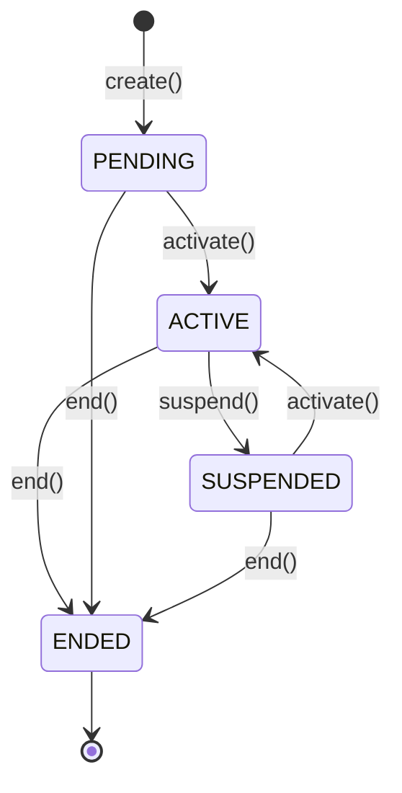

# Assignment Management Domain

The Assignment Management Domain is the authoritative source of truth for human resource assignments within FleetGuard.

## Architecture

This domain follows Domain-Driven Design (DDD) principles and CQRS. It is entirely independent and only references other domains (such as Vehicle or Driver) via their IDs.

### Scope
- **In Scope:** `DRIVER_TO_VEHICLE` assignments.
- **Out of Scope:** Hardware assignments (GPS trackers, Fuel sensors), which are handled by the `device_registry`.

### Aggregate Design
`AssignmentAggregate` enforces invariants around the temporal association of resources.

### Lifecycle & Invariants
- A Driver can only have **one** active vehicle assignment at a time.
- A Vehicle can only have **one** active driver assignment at a time.
- Assignments are temporal (have `effective_from` and `effective_until`).
- Historical assignments are immutable.

## Components
- **Aggregate**: `AssignmentAggregate`
- **Service**: `AssignmentService`
- **Query Layer**: `AssignmentQueryService`
- **Repository**: `BaseAssignmentRepository` (with `InMemoryAssignmentRepository`)

## Events
The domain emits the following events:
- `AssignmentCreated`
- `AssignmentActivated`
- `AssignmentSuspended`
- `AssignmentEnded`
- `AssignmentTransferred`
