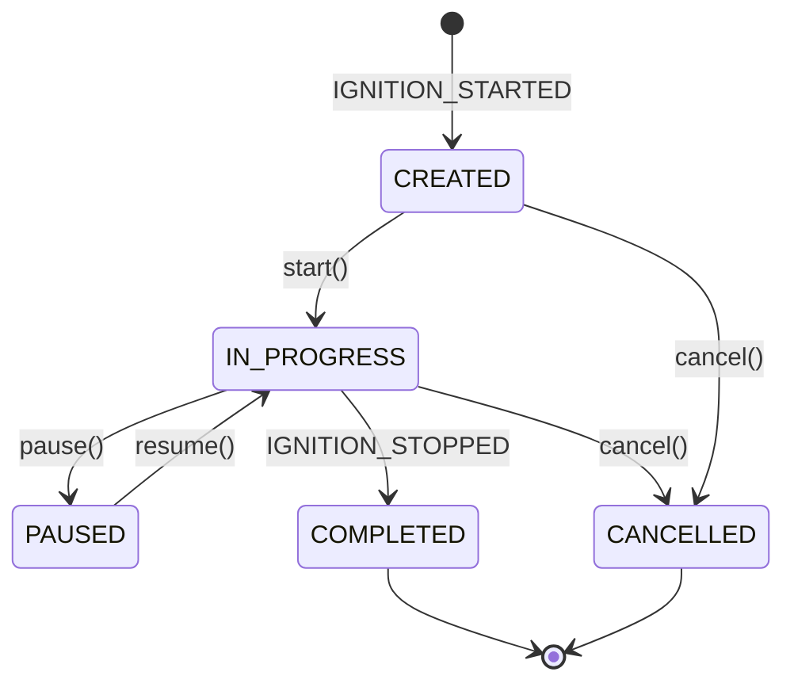
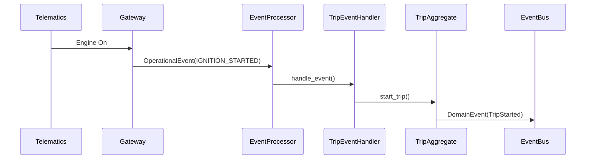

# Trip Management Domain

The Trip Management Domain is the authoritative source of truth for vehicle movement in FleetGuard.

## Architecture

This domain strictly follows FleetGuard's Event-Driven Architecture.
Trip is an **Event-Sourced Subsystem**. It exposes **NO REST API endpoints for mutation** (`POST /trips/start` does not exist).
The trip lifecycle is deterministically driven by immutable Operational Events via the `TripEventHandler`.

### Scope
- **In Scope:** Movement tracking (origin, destination, distance, duration).
- **Out of Scope:** Vehicle logic, Driver Assignment logic, Device mapping, or intelligence processing.

### Aggregate Design
`TripAggregate` enforces invariants around the lifecycle transitions.

### Event Flow

## Components
- **Aggregate**: `TripAggregate`
- **Event Handler**: `TripEventHandler`
- **Service**: `TripService`
- **Query Layer**: `TripQueryService`
- **Repository**: `BaseTripRepository` (with `InMemoryTripRepository`)

## Events
The domain emits the following Domain Events:
- `TripCreated`
- `TripStarted`
- `TripPaused`
- `TripResumed`
- `TripCompleted`
- `TripCancelled`
