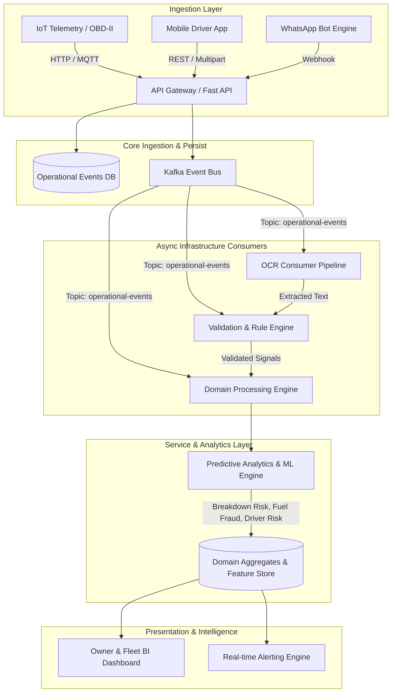
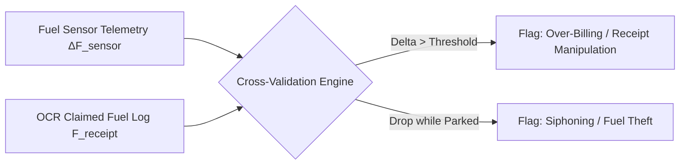

# FleetGuard System Architecture, Presentation Blueprint & Prediction Logic Engine

---

## EXECUTIVE SUMMARY

**FleetGuard** is an enterprise-grade, event-driven Fleet Telematics, Expense Fraud Detection, and Predictive Intelligence Platform. Designed for modern logistics and heavy-vehicle transport fleets, FleetGuard integrates real-time IoT vehicle data, automated receipt parsing via OCR/AI vision, rule-based validation engines, and predictive analytics to minimize vehicle downtime, prevent fuel fraud, lower total cost of ownership (TCO), and ensure driver safety.

---

# SECTION 1: SYSTEM ARCHITECTURAL SPECIFICATION

### 1. Architectural Layers Breakdown

#### 1. Ingestion Layer
* **API Gateway / FastAPI Core:** Provides high-performance, asynchronous REST endpoints for multi-tenant access, supporting vehicle telematics, receipt document uploads, and manual logging.
* **Invariant Protocol (*Persist Event -> Publish Event*):** Raw events are immediately written to an immutable `operational_events` table before being broadcast, guaranteeing 0% data loss even during broker restarts.

#### 2. Event Transport (Kafka Event Bus)
* **Topics & Partitioning:** Utilizes Apache Kafka for message streaming. Messages use `entity_id` (e.g., `vehicle_id`, `trip_id`) as the partition key to enforce strict per-entity ordering while scaling horizontally.
* **Consumer Groups:** Independent consumer groups (`ocr-group`, `validation-group`, `processing-group`) process incoming operational events asynchronously without blocking the write path.

#### 3. Asynchronous Infrastructure Processing
* **OCR & Vision Pipeline:** Intercepts document upload events (`DOCUMENT_UPLOADED`), extracts text via multi-modal AI models (Google Document AI / Azure Document Intelligence / Vision LLMs), and emits `DOCUMENT_TEXT_EXTRACTED` events.
* **Validation & Rule Engine:** Evaluates operational constraints (duplicate invoice numbers, location fencing, anomaly checks) and tags events with execution status (`VALIDATED`, `FLAGGED`, `REJECTED`).
* **Domain Processing Engine (State Projections):** Applies validated events to domain aggregates (`FuelLog`, `Vehicle`, `Driver`, `Trip`, `Tyre`, `Maintenance`, `Expense`).

#### 4. Predictive Analytics & Machine Learning Engine
* **Risk & Scoring Services:** Continuously consumes domain state updates to execute predictive maintenance algorithms, driver safety scoring, fuel theft anomaly detection, and tyre wear forecasting.

---

# SECTION 2: PPT PRESENTATION BLUEPRINT & EXPLANATION GUIDE

This section provides a 10-slide PowerPoint structure designed for clear explanation during pitch meetings, client presentations, or technical reviews.

---

### SLIDE 1: Title & Executive Introduction
* **Header:** FleetGuard: Next-Gen AI & Event-Driven Fleet Telematics
* **Subtitle:** Eliminating Fleet Downtime & Fraud Through Predictive Intelligence
* **Visual Layout:**
  - Left Column: Bold title, platform vision, key metrics (e.g., 25% downtime reduction, 99.4% fraud detection accuracy).
  - Right Column: Sleek dashboard preview graphic or logo asset.
* **Speaker Script:**
  > "Welcome everyone. Today we present FleetGuard—an enterprise-grade intelligence platform engineered to transform how logistics operations handle fleet maintenance, fuel tracking, and driver safety. By leveraging real-time event streaming and predictive ML models, FleetGuard converts raw operational noise into actionable financial and preventive insights."

---

### SLIDE 2: Industry Pain Points & Problem Statement
* **Header:** Operational Challenges in Fleet Management
* **Visual Layout:** 3-Card Grid (Red/Orange accent cards)
  1. **Unplanned Downtime:** Unexpected component failure causing late deliveries and expensive emergency repairs.
  2. **Fuel Theft & Billing Fraud:** Misreported fuel fills, manipulated receipts, and unauthorized siphoning.
  3. **High Maintenance TCO:** Reactive maintenance instead of condition-based predictive maintenance.
* **Speaker Script:**
  > "Fleet operators face three massive revenue drains: unpredictable vehicle breakdowns, untracked fuel siphoning, and rising total cost of ownership due to reactive repair cycles. Traditional fleet software only logs events *after* money is spent. FleetGuard changes this by predicting failures and detecting fraud in real time."

---

### SLIDE 3: System Architecture Overview
* **Header:** High-Level Architecture: Event-Driven & Decoupled
* **Visual Layout:** Full-width Mermaid System Diagram (Ingestion $\rightarrow$ Kafka $\rightarrow$ Engines $\rightarrow$ Dashboard)
* **Talking Points:**
  - Low-latency write path (< 50ms ingestion response time).
  - Guaranteed event persistence before asynchronous stream distribution.
  - Pluggable infrastructure: OCR, Validation Rules, and ML logic scale independently.
* **Speaker Script:**
  > "Here is the high-level architecture of FleetGuard. At its core is an Event-Driven Architecture powered by Apache Kafka. When a driver uploads a fuel receipt or a vehicle transmits telematics, the event is immediately persisted to the immutable operational log and published. Independent consumer engines then process OCR extraction, validation rules, domain state updates, and predictive analytics simultaneously."

---

### SLIDE 4: The Ingestion & OCR Evidence Pipeline
* **Header:** Automated Document Intelligence & Evidence Framework
* **Visual Layout:** Split Screen
  - Left: Step-by-step flowchart (Document Upload $\rightarrow$ OCR Extraction $\rightarrow$ Data Structuring $\rightarrow$ Event Validation).
  - Right: Mockup of receipt image being scanned with bounding boxes highlighting Volume (L), Total Cost ($), and Station Name.
* **Speaker Script:**
  > "FleetGuard completely automates receipt processing. Drivers simply upload a picture via our app or WhatsApp bot. Our OCR Consumer immediately extracts vendor name, fuel volume, transaction timestamps, and total cost, converting physical paper into structured event streams without human data entry."

---

### SLIDE 5: Validation & Rule Engine
* **Header:** Real-Time Operational Guardrails & Fraud Prevention
* **Visual Layout:** 2x2 Matrix showing core validation rules:
  1. **Geo-Location Match:** Fuel pump GPS vs Vehicle OBD-II location.
  2. **Tank Capacity Limit:** Refill volume vs vehicle tank max size.
  3. **Duplicate Invoice Lock:** Hash matching across historical receipts.
  4. **Consumption Baseline Check:** L/100km vs historical vehicle norm.
* **Speaker Script:**
  > "Before any expense is approved, the Validation Engine subjects the event to automated rules. If a driver claims 400 Liters of diesel into a 300-Liter tank, or if the GPS coordinates of the fuel receipt don't match the truck's actual location, the system instantly flags a fraud alert and places the ticket into pending admin review."

---

### SLIDE 6: Predictive Analytics & ML Core
* **Header:** AI-Driven Predictive Intelligence
* **Visual Layout:** 4 Feature Nodes connected to a Central Intelligence Hub:
  - Node A: Breakdown Risk Index (BRI)
  - Node B: Fuel Theft Anomaly Detection
  - Node C: Driver Safety & Risk Score
  - Node D: Tyre Tread Lifespan Forecast
* **Speaker Script:**
  > "FleetGuard doesn't just record history; it predicts the future. Our Predictive ML Engine combines real-time telematics, diagnostic trouble codes (DTC), driver behavior metrics, and component age to calculate vehicle failure probabilities before breakdowns happen."

---

### SLIDE 7: Prediction Logic Deep Dive – Breakdown Risk Index (BRI)
* **Header:** Multi-Factor Vehicle Breakdown Prediction Engine
* **Visual Layout:** Formula Box + Risk Gauge Graphic (Green/Yellow/Red)
  - Formula display: $\text{BRI} = w_1 \cdot \text{DTC}_{\text{weight}} + w_2 \cdot f(\Delta \text{Temp}) + w_3 \cdot e^{\lambda \cdot \text{Age}} + w_4 \cdot (1 - \text{MaintScore})$
  - Breakdown breakdown breakdown by risk tiers (Low < 30%, Medium 30-70%, High > 70%).
* **Speaker Script:**
  > "Our Breakdown Risk Index evaluates engine temperature anomalies, fault codes, mileage exponential decay, and service adherence. When BRI exceeds 70%, FleetGuard automatically generates a preventive maintenance work order, scheduling service during planned driver rest stops."

---

### SLIDE 8: Prediction Logic Deep Dive – Fuel Theft & Anomaly Engine
* **Header:** Dual-Layer Cross-Validation Fuel Fraud Model
* **Visual Layout:** Comparison Chart: Telematics Fuel Drop vs Receipt Refill Log.
* **Speaker Script:**
  > "For fuel protection, we cross-validate OBD-II fuel level sensors against OCR receipt data. If the sensor records a sudden fuel drop while the vehicle is parked, or if reported receipt volume exceeds sensor deltas by more than 5%, a high-risk theft alert is triggered instantly."

---

### SLIDE 9: Business Impact & ROI
* **Header:** Quantifiable Enterprise Value & Cost Savings
* **Visual Layout:** 3 Large Stat Callouts
  - **-32%** Reduction in Fleet Maintenance Costs
  - **-85%** Reduction in Fuel Fraud & Duplicate Claims
  - **+18%** Improvement in Fleet Uptime & Vehicle Availability
* **Speaker Script:**
  > "Deploying FleetGuard yields immediate financial returns. Fleet operators cut maintenance expenses by over 30% through condition-based servicing, virtually eliminate fuel fraud, and maximize fleet uptime."

---

### SLIDE 10: Implementation Roadmap & Summary
* **Header:** Modular Deployment & Future Scalability
* **Visual Layout:** Timeline roadmap (Phase 1: Core Telematics & Event Ingestion, Phase 2: OCR & Validation Rules, Phase 3: ML Models & Predictive Alerts).
* **Speaker Script:**
  > "FleetGuard's modular event-driven architecture ensures rapid deployment. We can integrate with existing hardware and legacy systems in days. Thank you, and we'd be glad to open the floor to questions."

---

# SECTION 3: PREDICTION LOGIC & AI/ML MATHEMATICAL ENGINE

This section details the mathematical formulas, algorithms, feature vectors, and inference pipelines used across FleetGuard's 4 core prediction models.

---

## 1. Vehicle Breakdown Risk Prediction Model (BRI)

### Mathematical Formulation
The **Breakdown Risk Index (BRI)** predicts the probability of critical vehicle failure within the next $N$ kilometers or $T$ operating hours. It is modeled using a sigmoid combination of weighted component failure indicators and Weibull cumulative hazard distributions:

$$\text{BRI}(v, t) = \frac{1}{1 + e^{-z(v, t)}}$$

Where $z(v, t)$ is defined as:

$$z(v, t) = \beta_0 + \beta_{\text{DTC}} \cdot S_{\text{DTC}} + \beta_{\text{temp}} \cdot \Delta T_{\text{engine}} + \beta_{\text{mileage}} \cdot \left(\frac{M_{\text{current}}}{M_{\text{rated}}}\right)^\alpha + \beta_{\text{maint}} \cdot (1 - H_{\text{service}})$$

### Feature Definitions & Parameters

| Variable | Description | Weight ($\beta_i$) | Range |
|---|---|---|---|
| $S_{\text{DTC}}$ | Severity-weighted diagnostic fault code score | 1.85 | $[0.0, 10.0]$ |
| $\Delta T_{\text{engine}}$ | Engine temperature deviation above normal ($^\circ\text{C}$) | 0.045 | $[0, 50]$ |
| $M_{\text{current}} / M_{\text{rated}}$ | Ratio of current vehicle mileage to rated overhaul mileage | 1.20 | $[0.0, 3.0]$ |
| $\alpha$ | Weibull wear-out shape factor (accelerated degradation) | 1.45 (const) | N/A |
| $H_{\text{service}}$ | Service adherence score (1.0 = on-time, 0.0 = overdue) | -1.50 | $[0.0, 1.0]$ |

### Diagnostic Severity Table ($S_{\text{DTC}}$)

$$S_{\text{DTC}} = \sum_{k \in \text{Active DTCs}} W_{\text{severity}}(k)$$

* Critical (P0200-Injector, P0300-Misfire, P0217-Overheat): $W = 4.0$
* Major (P0101-MAF, P0420-Catalytic): $W = 2.0$
* Minor (P0113-IAT, P0440-EVAP): $W = 0.5$

---

## 2. Predictive Maintenance Engine & Remaining Useful Life (RUL)

### Remaining Useful Life (RUL) Formula
Remaining Useful Life for critical sub-components (Engine Oil, Brake Pads, Air Filters, Transmission Fluid) is estimated using a continuous degradation hazard model based on the Weibull survival function $R(t)$:

$$R(t) = \exp \left( - \left( \frac{t}{\eta_{\text{effective}}} \right)^\beta \right)$$

$$\text{RUL}_{\text{km}} = \eta_{\text{effective}} \cdot \left( -\ln(R_{\text{threshold}}) \right)^{1/\beta} - M_{\text{accumulated}}$$

Where the effective scale parameter $\eta_{\text{effective}}$ is dynamically adjusted based on operating stress factors (load, ambient temperature, driving style):

$$\eta_{\text{effective}} = \eta_0 \cdot \gamma_{\text{load}}^{-1} \cdot \gamma_{\text{temp}}^{-1} \cdot \gamma_{\text{driver}}^{-1}$$

- $\eta_0$: Manufacturer rated component baseline life (km).
- $\gamma_{\text{load}}$: Vehicle load stress factor ($= 1.0 + 0.5 \cdot \frac{\text{Payload}}{\text{Max Capacity}}$).
- $\gamma_{\text{driver}}$: Driver harshness index ($= 0.8 + 0.4 \cdot \text{HarshEventRate}$).

---

## 3. Fuel Theft & Consumption Anomaly Detection Engine

FleetGuard uses a **Dual-Vector Cross-Validation** approach combining IoT fuel level sensors with receipt OCR data.

### Anomaly Logic Equations

#### 1. Receipt vs Tank Sensor Discrepancy ($\Delta F_{\text{discrepancy}}$)

$$\Delta F_{\text{discrepancy}} = | F_{\text{receipt}} - (F_{\text{tank\_after}} - F_{\text{tank\_before}}) |$$

$$\text{TheftAlert}_{\text{receipt}} = \begin{cases} \text{TRUE}, & \text{if } \Delta F_{\text{discrepancy}} > \max(5.0\text{ Liters}, 0.05 \cdot F_{\text{receipt}}) \\ \text{FALSE}, & \text{otherwise} \end{cases}$$

#### 2. Static Tank Siphoning Detection (Unexplained Drop)

$$\Delta F_{\text{siphon}} = F_{\text{tank}}(t_1) - F_{\text{tank}}(t_2) \quad \text{where } \text{Speed}(t_1 \to t_2) = 0 \text{ and EngineStatus} = \text{OFF}$$

$$\text{TheftAlert}_{\text{siphon}} = \begin{cases} \text{TRUE}, & \text{if } \Delta F_{\text{siphon}} > 3.5\text{ Liters} \\ \text{FALSE}, & \text{otherwise} \end{cases}$$

---

## 4. Driver Safety & Risk Scoring Engine

The **Driver Risk Score (DRS)** evaluates driver behavior over a rolling 30-day window on a scale of $0 \text{ to } 100$ (where $100$ represents perfect safety).

### Scoring Equation

$$\text{DRS} = 100 - \min \left( 100, \, w_{\text{hb}} \cdot E_{\text{hb}} + w_{\text{ha}} \cdot E_{\text{ha}} + w_{\text{os}} \cdot E_{\text{os}} + w_{\text{night}} \cdot R_{\text{night}} + w_{\text{speed\_var}} \cdot \sigma_{\text{speed}} \right)$$

Where rates are normalized per 100 kilometers driven ($D_{\text{total}} / 100$):

* $E_{\text{hb}}$: Harsh Braking events per 100 km ($w_{\text{hb}} = 6.0$)
* $E_{\text{ha}}$: Harsh Acceleration events per 100 km ($w_{\text{ha}} = 4.0$)
* $E_{\text{os}}$: Overspeeding duration (minutes over limit per 100 km) ($w_{\text{os}} = 3.5$)
* $R_{\text{night}}$: Percentage of driving during high-fatigue hours (11 PM - 5 AM) ($w_{\text{night}} = 15.0$)
* $\sigma_{\text{speed}}$: Speed variance standard deviation ($w_{\text{speed\_var}} = 2.0$)

---

## 5. Tyre Lifespan & Wear Prediction Model

Tyre tread depth decay is predicted using a load-and-pressure adjusted wear model:

$$d_{\text{tread}}(m) = d_{\text{initial}} - k_{\text{wear}} \cdot m$$

Where $m$ is cumulative distance (in thousands of km), and $k_{\text{wear}}$ is the dynamic wear coefficient (mm per 1,000 km):

$$k_{\text{wear}} = k_0 \cdot \left( \frac{P_{\text{rated}}}{P_{\text{actual}}} \right)^{\theta_1} \cdot \left( \frac{L_{\text{actual}}}{L_{\text{rated}}} \right)^{\theta_2}$$

* $k_0$: Baseline tread wear rate ($0.12 \text{ mm / 1000 km}$)
* $P_{\text{rated}} / P_{\text{actual}}$: Tyre pressure deviation factor ($\theta_1 = 1.6$)
* $L_{\text{actual}} / L_{\text{rated}}$: Axle load factor ($\theta_2 = 1.3$)

When $d_{\text{tread}}(m) \le d_{\text{minimum}} \text{ (1.6 mm legal limit)}$, the system triggers a **Tyre Replacement Work Order**.

---

## RECAP & SUMMARY FOR PRESENTERS

1. **Architecture Strength:** FleetGuard's asynchronous, event-driven pattern ensures low API latencies while scaling OCR, validation, and analytics independently.
2. **Fraud Prevention:** Multi-vector verification (GPS + Sensor + Receipt OCR) blocks invoice manipulation at ingestion.
3. **Predictive Analytics:** Mathematical models continuously calculate breakdown risk (BRI), remaining component life (RUL), driver safety scores (DRS), and tyre wear.
