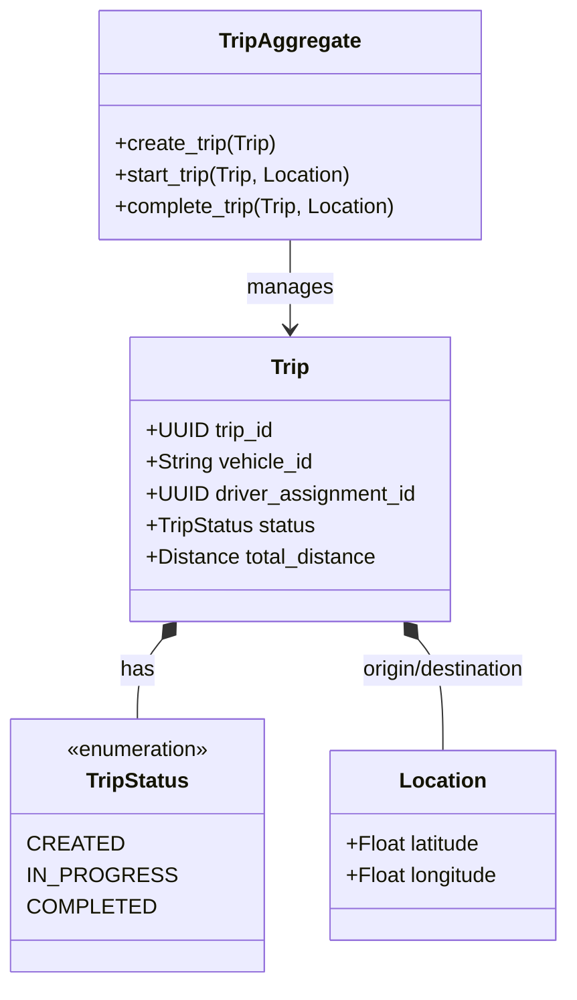

# Trip Management Domain: Domain Model

This document details the internal design of the Trip domain's components following Domain-Driven Design principles.

## Aggregate Root: `TripAggregate`
The `TripAggregate` is the sole guardian of the trip lifecycle. Its purpose is to enforce invariants. For example, it guarantees that a `COMPLETED` trip can never be transitioned to `IN_PROGRESS`, and that a trip cannot start without an origin. All changes to the `Trip` entity happen via the aggregate.

## Entities: `Trip`
The core business entity.
- **Immutability:** The entity itself is modeled as a frozen `pydantic` BaseModel. Mutations return a new instance of the model.
- **Identity:** Uniquely identified by `trip_id`.
- **References:** Maintains foreign references (`vehicle_id`, `driver_assignment_id`) without loading the external models.

## Value Objects
Value Objects are immutable, identity-less structures encapsulating domain concepts.
- `TripId`: Strongly typed UUID wrapper.
- `Location`: Encapsulates spatial coordinates (`latitude`, `longitude`) preventing loose float variables.
- `Distance`: Encapsulates distance metrics securely.
- `Duration`: Represents time boundaries clearly.

## Domain Services: `TripService`
The `TripService` provides orchestration. It sits between the Event Handler and the Aggregate.
- **Why it exists:** The Aggregate handles pure business logic but doesn't know about databases. The Event Handler knows about events but shouldn't contain business logic. `TripService` bridges them by retrieving the state from the repository, passing it to the aggregate, and saving the result.

## Repositories: `BaseTripRepository`
Abstracts persistence away from the domain logic.
- **Why it exists:** Allows swapping out the storage engine (e.g., from `InMemoryTripRepository` for tests to a PostgreSQL backend) without changing business rules.

## Read Models (Projections)
- `ActiveTripSummary`, `VehicleTripSummary`.
- **Why they exist:** To provide highly optimized data for UI dashboards without the overhead of loading full aggregates and recalculating fields.

## Domain Events
Events that signal to the broader system that the Trip state has changed (e.g., `TripStarted`, `TripCompleted`).
- **Why they exist:** They decouple the Trip domain from its consumers (e.g., the Fleet Intelligence Engine).

---

## Class Diagram

