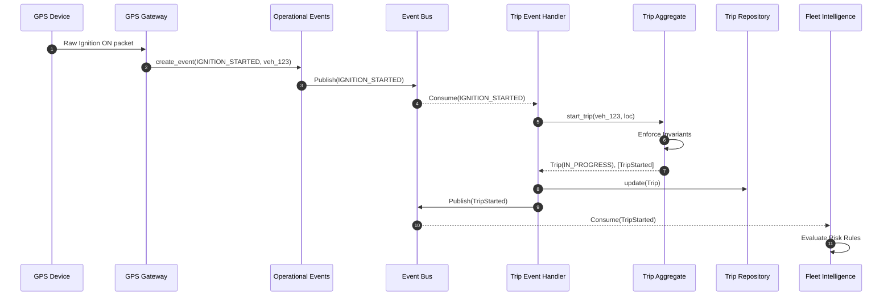

# Trip Management Domain: Event Flow

The Trip domain acts as an **Event-Sourced Projection** of FleetGuard's Operational Events. It reacts to physical realities captured by upstream systems and emits logical realities for downstream systems.

## The Complete Lifecycle Pipeline

When a vehicle begins moving:
1. **Telematics / GPS Device:** Detects an engine start or movement and sends a raw packet over TCP/MQTT.
2. **GPS Gateway:** Decodes the raw packet, authenticates it, and maps it to a specific `vehicle_id`.
3. **Operational Event Service:** The Gateway creates a persistent, immutable fact: `OperationalEvent(type=IGNITION_STARTED)`.
4. **Event Bus (Kafka):** The operational event is placed on the core enterprise bus.
5. **Trip Event Handler:** The Trip domain subscribes to this bus. It pulls the `IGNITION_STARTED` event.
6. **Trip Aggregate:** The Event Handler commands the `TripAggregate` to start a trip.
7. **Repository:** The new trip state is persisted to the database.
8. **Domain Events:** The `TripAggregate` generates a `TripStarted` Domain Event, which is pushed to an outbound topic.
9. **Fleet Intelligence Engine:** Consumes the `TripStarted` event to perform behavioral scoring and risk assessments in real-time.

## Sequence Diagram

