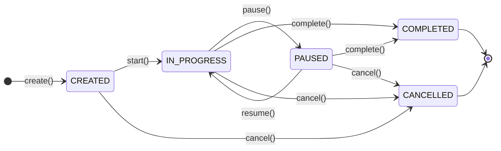

# Trip Management Domain: Lifecycle

The `Trip` entity is a highly regulated state machine. State transitions are explicitly modeled and validated by the `TripAggregate`. No state can be skipped or bypassed.

## States

- **CREATED**: The initial placeholder state. A trip intention or physical movement has been registered but not fully established with parameters.
- **IN_PROGRESS**: The vehicle is actively moving. Origin coordinates and timestamps are locked.
- **PAUSED**: The vehicle has stopped temporarily (e.g., at a rest stop or traffic jam). Engine might be off, but the business context implies the journey will resume.
- **COMPLETED**: The journey has reached a terminal conclusion. Destination coordinates and final timestamps are locked. The entity becomes immutable.
- **CANCELLED**: The trip was aborted due to data error, cancellation by dispatch, or system reset. The entity becomes immutable.

## State Transitions Explained

- `CREATED -> IN_PROGRESS`: Triggered by physical vehicle movement (`IGNITION_STARTED`). Locks the driver context.
- `IN_PROGRESS -> PAUSED`: Triggered by idle timeouts or specialized events. Pauses driving duration counters.
- `PAUSED -> IN_PROGRESS`: Triggered by renewed movement (`POSITION_RECORDED`). Resumes counters.
- `IN_PROGRESS -> COMPLETED`: Triggered by the end of the shift or prolonged shutdown (`IGNITION_STOPPED`). Calculates total final distance.

## State Diagram

