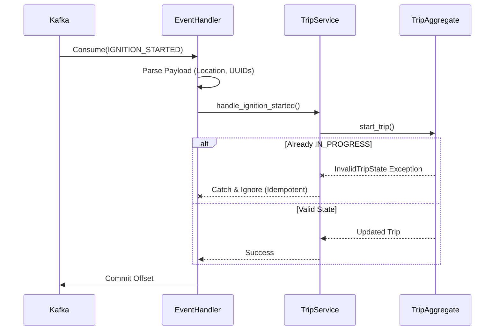

# Trip Management Domain: Event Handler

The `TripEventHandler` is the vital link between the physical world (Operational Events) and the logical domain.

## Responsibilities
- Subscribe to the Operational Event bus.
- Filter irrelevant events.
- Extract domain parameters (`vehicle_id`, coordinates) from raw event payloads.
- Invoke the appropriate business commands on the `TripService`.

## Events Consumed
- `IGNITION_STARTED`: Interpreted as the intent to move. Triggers `start_trip`.
- `IGNITION_STOPPED`: Interpreted as the end of movement. Triggers `complete_trip`.
- `POSITION_RECORDED`: In-flight GPS pings. Used for calculating running distance and idle detection.

## Error Handling & Retry Strategy
If the Event Handler encounters a transient failure (e.g., database lock timeout while trying to save a trip), the underlying Kafka infrastructure will trigger its `RetryExecutor`.
If all retries are exhausted, the event is routed to the Dead Letter Queue (DLQ), and the offset is committed. This ensures the pipeline does not stall.

## Idempotency
Because the `TripAggregate` strictly validates states (e.g., it will throw an error if commanded to `start_trip` when the status is already `IN_PROGRESS`), the event handler must catch and gracefully ignore `InvalidTripState` errors when processing duplicated events, ensuring idempotency.

## Sequence Diagram

