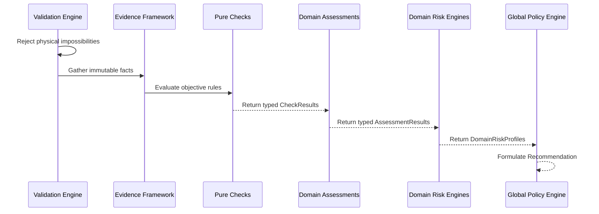

# Fleet Intelligence Architecture

## Overview
The Fleet Intelligence Engine evaluates operational events across the FleetGuard platform to determine their legitimacy, probabilistic risk level, and final disposition. It operates under the assumption of **Adaptive Intelligence**: evidence is heterogeneous, and the engine must make the best possible decision with the available data rather than failing when optional data is missing.

## Business Motivation
FleetGuard separates **Validation** from **Intelligence** to delineate impossible physical constraints from improbable behavioral anomalies. 
- A fuel fill claiming 500 liters on a 200-liter tank is a physical impossibility. The Validation Engine rejects this outright.
- A fuel fill occurring at 3 AM at an unmapped station is physically possible but highly suspicious. The Intelligence Engine scores this as a risk.
This separation ensures the Intelligence Engine focuses purely on fraud, behavior, and policy without being cluttered by basic structural rules.

## Architecture Overview
The architecture forms a strict 5-tier adaptive funnel.

## Core Components
- **Evidence**: The fundamental facts (e.g., GPS coordinates, fuel sensor deltas). The Evidence Framework collects and enforces immutability.
- **Checks**: Pure, objective evaluators (e.g., "Is distance > 100km?"). Checks consume Evidence and produce a `CheckStatus` (`PASS`, `FAIL`, `SKIPPED`, `ERROR`) alongside typed metadata.
- **Assessments**: Business aggregators that combine multiple Checks to answer domain-specific questions (e.g., "Driver Fatigue Level").
- **Domain Risk Engines**: Decentralized risk calculators (e.g., `FuelRiskEngine`, `DriverRiskEngine`) that consume Assessments to generate a `DomainRiskProfile`.
- **Global Policy Engine**: The final decision authority that evaluates all `DomainRiskProfiles` to make overarching business decisions (e.g., "If any domain is CRITICAL, REJECT").
- **Recommendation**: A structured object representing the final action (`APPROVE`, `REVIEW`, `REJECT`), the primary reason, and the full traceability tree.

## Design Principles
- **Separation of Facts from Decisions**: Evidence describes what happened; Risk Engines decide what it means.
- **Immutability**: Evidence is frozen upon creation.
- **Explainability**: Every automated decision must be traceable back to the raw evidence.
- **Extensibility**: New evidence and domains can be added via isolated registries.
- **Domain Isolation**: Fuel risks and Driver risks are encapsulated in their respective engines before reaching the Global Policy level.
- **Strong Typing**: Elimination of arbitrary float scores and generic dictionaries in favor of typed enums and schemas.
- **Adaptive Execution**: Missing evidence gracefully skips specific Checks rather than crashing the pipeline.

## Explainability Model
FleetGuard operates in a high-trust logistics environment. A "Black Box" intelligence engine is unacceptable. The final `Recommendation` output is a complete tree of evidence. 
A fleet manager's dashboard can trace exactly why a fuel fill was rejected:
*Recommendation: REJECT → FuelDomainRisk is CRITICAL → FuelLegitimacyAssessment flagged Anomaly → GPSProximityCheck FAILED → GPSEvidence showed truck was 200km away.*

## Extension Guide
Future intelligence domains (Maintenance, Tyres, Trips) easily integrate into this architecture:
1. Define new `BaseEvidence` subclasses (e.g., `TyreEvidence`).
2. Create `IntelligenceCheck` classes targeting the new evidence.
3. Combine checks in a `TyreAssessment`.
4. Create a `TyreRiskEngine` that outputs a `DomainRiskProfile`.
5. The `GlobalPolicyEngine` automatically ingests the new profile to inform global recommendations.

## Developer Notes
- **Check Purity**: Checks MUST NOT import repositories, services, or perform HTTP/DB calls.
- **No Mutations**: No layer in the Intelligence pipeline may mutate the database or original event states.
- **Type Safety**: Never use generic `payload: dict` for business logic. Always define explicit Pydantic fields.

## Future Milestones
The foundation laid in FI-003 and FI-004 establishes the Evidence Framework. Future milestones will build actual domain rules (Checks, Assessments) and wire the Risk Engines to process real-time operational streams.
