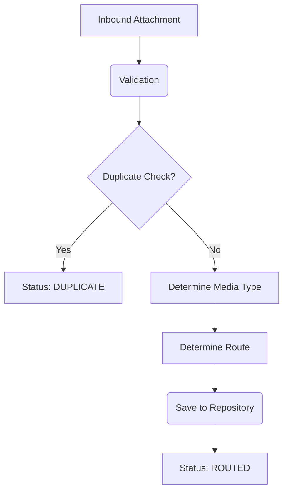

# Attachment Processing Framework

## Architecture Overview
The Attachment Processing Framework is the centralized engine responsible for managing the lifecycle of all inbound media (images, PDFs, audio, video) ingested by FleetGuard. 

Acting as the bridge between the Communication Gateway and specialized media processors (like OCR engines), this framework establishes a deterministic pipeline to validate integrity, detect duplicate uploads, and safely route references to their appropriate downstream consumers.

### Scope and Boundaries
**The Attachment Processing Framework DOES:**
- Receive normalized `Attachment` objects (produced by the Communication Gateway).
- Validate file boundaries (e.g., maximum size thresholds).
- Validate MIME constraints (whitelisting allowable formats).
- Detect and halt duplicate processing using checksums.
- Persist attachment metadata via an abstract `AttachmentRepository`.
- Deterministically route attachments to a defined target string (e.g., `ImageProcessor`, `DocumentProcessor`).

**The Attachment Processing Framework DOES NOT:**
- Execute OCR, image labeling, or document understanding.
- Interpret the bytes of the media payload directly for business rules.
- Download the physical bytes of the attachment (it manages the `storage_uri` references).

## Processing Lifecycle

1. **Reception**: The `AttachmentProcessingExecutor` receives an `Attachment` object.
2. **Validation**: Core validators run (e.g., missing file reference). The designated `BaseAttachmentHandler` performs specific validation.
3. **Duplicate Detection**: The `AttachmentRepository` evaluates `.exists_by_checksum()`. If true, processing stops safely with `DUPLICATE`.
4. **Categorization & Routing**: The handler determines the media type and designates a downstream topic/queue (e.g., `DocumentProcessor`).
5. **Persistence**: The metadata is saved in the repository.
6. **Result Generation**: Returns an `AttachmentProcessingResult` outlining success/failure and the final routing target.

## Duplicate Detection Strategy
Deduplication prevents massive, unnecessary computational loads on downstream machine learning / OCR engines. 
- It relies upon the `checksum` metadata (e.g., SHA-256) evaluated at the edge (by the Communication Gateway or upload client).
- The `AttachmentRepository` implements `.exists_by_checksum()`.
- If a checksum collision occurs, the framework acknowledges receipt but returns an `AttachmentStatus.DUPLICATE`, guaranteeing idempotency without executing the heavy processors twice.

## Core Components
- **`BaseAttachmentHandler`**: The abstract contract for handling media specific rules.
- **`AttachmentHandlerRegistry`**: Deterministic registration dictionary for handlers.
- **`AttachmentRepository`**: Abstract persistence layer (with an `InMemoryAttachmentRepository` supplied for testing).
- **`AttachmentProcessingExecutor`**: The main execution loop wrapping all of the logic together and isolating failures.

## Extension Guide
To integrate a new media type processor (e.g., 3D LIDAR scans):
1. Create a new handler extending `BaseAttachmentHandler`.
2. Implement `.validate()` for LIDAR specific constraints.
3. Implement `.determine_media_type()` and `.route()` (e.g., `LidarProcessor`).
4. Register the handler in the `AttachmentHandlerRegistry`.

## Anti-Patterns
- **Repository Coupling**: Do not bypass the `AttachmentRepository` interface. Future implementations will seamlessly swap the `InMemoryAttachmentRepository` for a Postgres or Redis based repository.
- **Content Interpretation**: Do not attempt to read the PDF text bytes in the `.validate()` method. Validation should only confirm metadata integrity.
