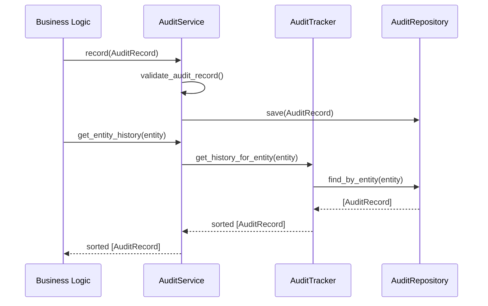

# Audit & Activity Framework

## Architecture Overview
The Audit & Activity Framework operates within the infrastructure layer (`infrastructure/audit/`). Its purpose is to provide a central, append-only persistence layer for recording immutable audit trails of significant actions occurring throughout FleetGuard.

It strictly implements the **Separation of Concerns**: The Audit Framework stores records. Business Logic determines what to store.

### Scope and Boundaries
**The Audit Framework DOES:**
- Record audit events and activity history.
- Track entity changes via `EntityChange` records.
- Capture execution metadata and actors.
- Support chronological and correlational retrieval.
- Provide append-only immutability.

**The Audit Framework DOES NOT:**
- Execute Fleet Intelligence.
- Enforce authorization rules.
- Determine if an action is "important".
- Generate Operational Events.

## Core Components
- **`AuditService`**: The frontend for recording new audit entries and retrieving history. Validates the structural integrity of records.
- **`AuditTracker`**: Provides a facade over the repository to support complex chronological retrieval and filtering (by actor, severity, time range, etc.).
- **`BaseAuditRepository`**: An abstract interface for append-only storage (currently `InMemoryAuditRepository`). It strictly omits `update()` and `delete()` operations.

## Lifecycle Diagram

## Immutable Data Models
- **`AuditEvent`**: An immutable definition of an event carrying contextual timestamps, severity, categorization, identifiers, and actors.
- **`EntityChange`**: A record defining what changed (`field_name`, `previous_value`, `new_value`).
- **`AuditRecord`**: Wraps the `AuditEvent` and any `EntityChange` instances into a single immutable payload.

## Correlation
The framework strongly relies on `correlation_id` chaining. A single workflow (e.g., Investigation -> Job -> Notification) should share a `correlation_id` allowing `AuditTracker.filter_records(correlation_id=...)` to rebuild the exact sequence of distributed actions across multiple FleetGuard systems.

## Anti-Patterns
- **Updating Audit Records**: Never attempt to update a historical audit record. If state changes, log a new `AuditRecord` detailing the `EntityChange`.
- **Authorization Enforcement**: Do not place permission checks in `audit_service.py`. The caller must handle authorization before logging an event.
