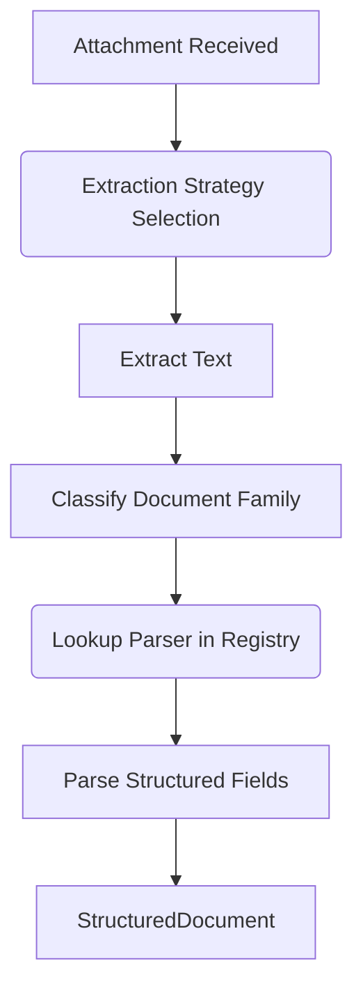

# Document Intelligence Framework

## Architecture Overview
The Document Intelligence Framework establishes a highly decoupled pipeline for ingesting inbound attachments, extracting textual payloads, classifying the semantic document family, and parsing out explicitly typed, structured fields.

Crucially, this framework is **business agnostic**. It identifies generic document structures (like an `INVOICE` or `CERTIFICATE`) and parses fields. It leaves the specific interpretation—such as deciding if an invoice is for Tyres or Fuel—to the downstream Intelligence interpretation layers.

### Scope and Boundaries
**The Document Intelligence Framework DOES:**
- Select extraction strategies (OCR vs Embedded Text).
- Perform text extraction, producing `ExtractionDiagnostics`.
- Deterministically classify the textual content into a generic `DocumentFamily`.
- Route the content to a structural `BaseDocumentParser`.
- Produce immutable `StructuredDocument` models mapped with `ExtractedField` arrays.

**The Document Intelligence Framework DOES NOT:**
- Create Business Evidence.
- Produce Operational Events.
- Run FleetGuard business rules (e.g. flagging a receipt as non-compliant).
- Make Intelligence assessments.

## Processing Lifecycle

1. **Extraction**: The `Attachment`'s `mime_type` dictates the `BaseTextExtractor` used (e.g., Image -> OCR; PDF -> EmbeddedText).
2. **Classification**: `classify_document` inspects the raw text for explicit terminology to assign a generic `DocumentFamily` (e.g., `RECEIPT`, `IDENTITY_DOCUMENT`).
3. **Parsing**: The `DocumentParserRegistry` resolves the parser mapped to that family. The parser utilizes regex/NER logic to pull `ExtractedField`s containing the `name`, `value`, and `confidence`.
4. **Output**: Produces an immutable `StructuredDocument` alongside diagnostic data and error traces inside a `DocumentProcessingResult`.

## Data Models
- **`ExtractedField`**: Replaces standard dictionaries with a rigid structure capturing the field's `value`, `confidence`, and `source_info`.
- **`ExtractionDiagnostics`**: Captures engine metadata, processing time, warnings, language, and rotation vectors—critical for debugging OCR deviations.
- **`DocumentFamily`**: Broad categorizations: `INVOICE`, `RECEIPT`, `CERTIFICATE`, `IDENTITY_DOCUMENT`, `FORM`, `UNKNOWN`.

## Extension Guide
To support a new type of extraction (e.g., Cloud Vision API):
1. Create a class extending `BaseTextExtractor`.
2. Implement `.extract()` yielding the string and `ExtractionDiagnostics`.
3. Add the route in `select_extraction_strategy()`.

To support a new generic Document Family:
1. Append the Family to the `DocumentFamily` enum.
2. Add keyword detection rules in `classify_document`.
3. Build a subclass of `BaseDocumentParser` configured to `supports()` the new family.
4. Register the parser via `DocumentParserRegistry.register()`.

## Anti-Patterns
- **Business Logic in Parsers**: Do not use parsers to validate data. For example, if an extracted "total_amount" is blank, the parser should capture it as blank. Do not throw an error because the receipt is "invalid". Let the downstream Validation Engine decide validity.
- **Direct Engine Coupling**: Do not import AWS or Tesseract dependencies inside the Executor. They belong explicitly within implementations of `BaseTextExtractor`.
