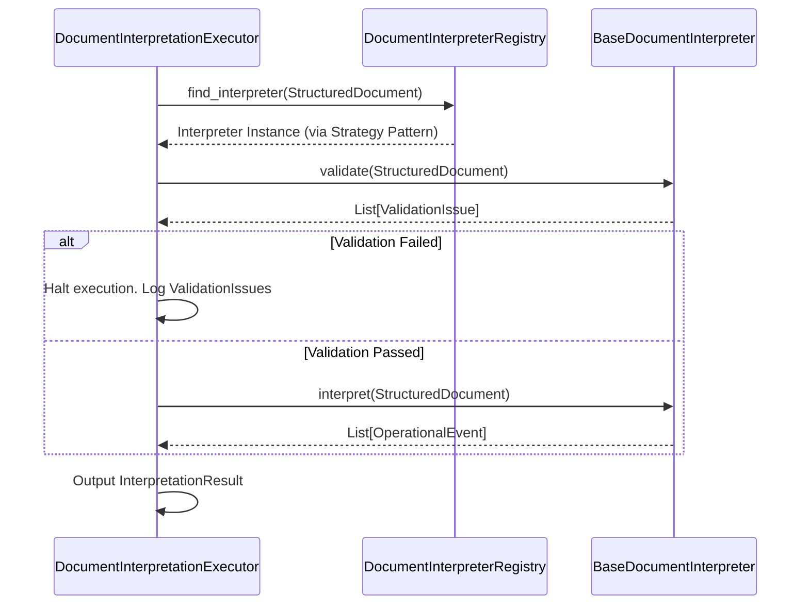

# FleetGuard Document Interpretation Framework

## Architecture Overview
The Document Interpretation Framework resides in the **Domain layer** and serves as the translation boundary between generic document semantics (extracted via Document Intelligence) and FleetGuard specific business facts.

It is responsible for identifying the explicit `BusinessDocumentType`, enforcing strict field validation rules, and generating immutable `OperationalEvent` objects (e.g. `FuelPurchaseRecorded`, `TyreReplacementRecorded`).

### Scope and Boundaries
**The Document Interpretation Framework DOES:**
- Use a Strategy Pattern to discover the appropriate `BaseDocumentInterpreter`.
- Identify the explicit `BusinessDocumentType` (e.g., `FUEL_RECEIPT`).
- Validate that generic extracted fields meet FleetGuard's minimum structural requirements.
- Produce immutable Operational Events that feed the downstream Intelligence Engine.

**The Document Interpretation Framework DOES NOT:**
- Execute OCR or evaluate raw text.
- Create analytical Evidence.
- Perform behavioral anomaly detection or fraud detection.
- Make business conclusions or recommendations.

## Processing Lifecycle

## Immutable Data Models
- **`BusinessDocumentType`**: Enum containing `FUEL_RECEIPT`, `MAINTENANCE_INVOICE`, `TYRE_INVOICE`, `INSURANCE_CERTIFICATE`, `REGISTRATION_CERTIFICATE`, `FITNESS_CERTIFICATE`, `POLLUTION_CERTIFICATE`, `DRIVER_LICENSE`, `UNKNOWN`.
- **`ValidationIssue`**: Tracks structural issues preventing interpretation. Captures `field_name`, `severity`, `error_code`, and `message`.
- **`BaseOperationalEvent`**: Immutable representations of observed business facts. For example: `FuelPurchaseRecorded` requires `fuel_quantity`, `total_amount`, and `purchase_date`.
- **`InterpretationResult`**: The final output wrapper containing generated operational events and validation issues.

## Extension Guide
To support a new FleetGuard business document type (e.g., Toll Receipt):
1. Add `TOLL_RECEIPT` to the `BusinessDocumentType` enum.
2. Define `TollPurchaseRecorded` extending `BaseOperationalEvent` in `events.py`.
3. Create `toll_receipt.py` extending `BaseDocumentInterpreter`.
4. Implement `.supports()` to trigger when the document family is `RECEIPT` and contains "TOLL".
5. Implement `.validate()` to ensure "total_amount" and "date" exist.
6. Implement `.interpret()` to map the extracted fields into `TollPurchaseRecorded`.
7. Register the interpreter in `DocumentInterpreterRegistry`.

## Anti-Patterns
- **Business Rule Abuse**: Do NOT use the interpreter to decide if a fuel purchase is fraudulent because the amount is too high. The interpreter merely records *that* a fuel purchase occurred. Downstream Intelligence Analyzers handle fraud detection.
- **Bypassing the Registry**: Do not hardcode `if/else` ladders in the executor to find an interpreter. Always rely on the registry's strategy pattern via `.supports()`.
