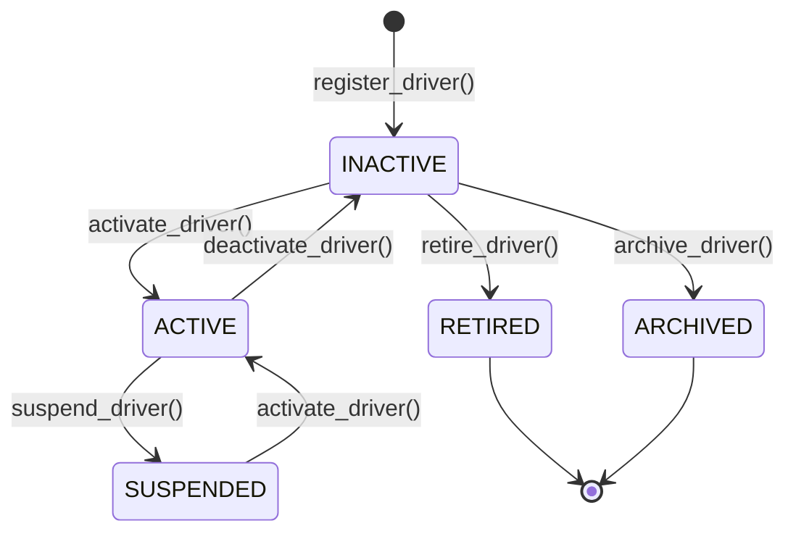

# Driver Management Domain

## Architecture Overview
The Driver Management Domain (`domain/driver/`) serves as the canonical source of truth for all driver identities, lifecycles, and qualification details (e.g., licences) across FleetGuard. Other domains (Trips, Compliance, Fuel, Maintenance, Intelligence) must reference canonical drivers using their UUID.

This domain implements a strict **Domain-Driven Design (DDD)** pattern, ensuring external modules cannot improperly mutate driver states. It also employs a lightweight **CQRS** pattern to cleanly separate the complex write rules (aggregates) from the fast, flattened read requirements (dashboards).

### Scope and Boundaries
**The Driver Domain DOES:**
- Act as the canonical owner of driver identifiers (UUID, Employee Code, Licence Number).
- Strictly enforce driver lifecycle transitions (`INACTIVE` -> `ACTIVE` -> `SUSPENDED`, etc.).
- Track and validate driver qualifications like Commercial Licences.
- Publish granular, immutable Domain Events (`DriverRegistered`, `DriverSuspended`, `DriverLicenceUpdated`) for downstream modules.
- Expose an optimized read model (`DriverSummary`) via `DriverQueryService`.

**The Driver Domain DOES NOT:**
- Execute or validate business rules unrelated to the core driver identity (e.g., Risk Calculation, Payroll).
- Own the relationship between Drivers and Vehicles (this belongs to the Assignment Domain).
- Manage Compliance expiry warning lifecycles (it only tracks if the date itself has passed).

## Core Components
- **`DriverAggregate`**: The Write-Side Aggregate Root. Direct mutation of the `Driver` model is prohibited. It enforces domain rules (e.g. state transition legality) and yields `(Driver, [DomainEvent])`.
- **`DriverService`**: Orchestrates write operations, interacting with the Repository to perform uniqueness checks (duplicate employee code/licence) before passing commands to the Aggregate.
- **`DriverQueryService` & `DriverSummary`**: The Read-Side (CQRS). Retrieves data efficiently formatted for the API/UI without navigating through the Aggregate logic.
- **`Value Objects`**: `EmployeeCode`, `PhoneNumber`, `EmailAddress`, and `DriverLicence` self-validate upon instantiation, meaning invalid data structures cannot exist within the domain layer.

## Lifecycle Diagram

## Anti-Patterns
- **Coupling Assignments**: The Driver module does not contain `assigned_vehicle`. Relationships to vehicles exist in an Operations/Assignment domain. The UI dashboard may stitch this data together later, but the core Driver model remains ignorant of Vehicles.
- **Bypassing the Aggregate**: Never update a `Driver` model directly via `model_copy(update={...})` from outside `aggregate.py`. Always call `DriverAggregate.some_action()`.
