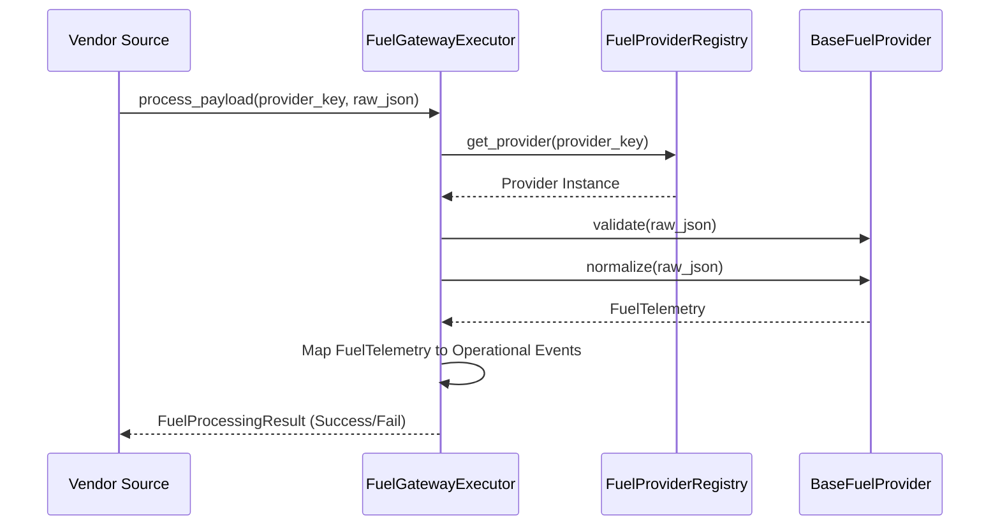

# Fuel Sensor Gateway Framework

## Architecture Overview
The Fuel Sensor Gateway Framework resides in the `infrastructure/fuel/` boundary layer. It provides a hardware-agnostic ingestion pipeline for external fuel level sensors (e.g. Omnicomm, Technoton, Escort). 

It validates incoming telemetry payloads, standardizes units and quality metadata, and translates vendor-specific telemetry into immutable FleetGuard Operational Events.

### Scope and Boundaries
**The Fuel Sensor Gateway Framework DOES:**
- Ingest and validate vendor-specific JSON payloads.
- Normalize telemetry data (UTC timestamps, unit mapping, decimal precision).
- Support generic and hardware-specific adapters (providers).
- Emit factual observations as `OperationalEvents` (`FuelLevelRecorded`, `SensorStatusChanged`).
- Expose the exact physical measurement reported by the hardware (`MeasurementUnit`: `LITRES`, `PERCENTAGE`, `ADC`, etc.), leaving calibration to downstream systems.
- Append a deterministic `TelemetryQuality` (`HIGH`, `MEDIUM`, `LOW`, `UNKNOWN`) to inform downstream confidence metrics.

**The Fuel Sensor Gateway Framework DOES NOT:**
- Map `device_id` to `vehicle_id`. That remains the responsibility of the Device Mapping Service.
- Detect fuel theft or calculate consumption efficiency.
- Detect fuel fills or drain events.
- Attempt to normalize arbitrary voltage/ADC data into litres.

## Processing Lifecycle

## Immutable Data Models
- **`MeasurementUnit`**: Enum supporting multiple physical domains (`LITRES`, `PERCENTAGE`, `MILLIMETERS`, `VOLTAGE`, `ADC`).
- **`TelemetryQuality`**: Contextual hint about reading reliability (`HIGH`, `MEDIUM`, `LOW`). 
- **`FuelTelemetry`**: The normalized snapshot. Retains original `device_id` and measurement scale.
- **`FuelProcessingResult`**: The execution wrapper tracking success/failure explicitly via the `FuelProcessingStatus` enum.
- **Operational Events (`events.py`)**: `FuelLevelRecorded`, `SensorStatusChanged`.

## Extension Guide
To add a new fuel sensor integration (e.g., `Meitrack`):
1. Create `meitrack.py` in `providers/` extending `BaseFuelProvider`.
2. Define `.key()` returning "meitrack".
3. Implement `.validate()` using `validate_telemetry_payload`.
4. Implement `.normalize()` converting the raw JSON into the `FuelTelemetry` model. Make use of `normalizers.py` to map raw units to `MeasurementUnit` and UTC dates.
5. Register the class in `FuelProviderRegistry`.

## Anti-Patterns
- **Calibration in Gateway**: Do not write code in a provider that converts ADC (Analog to Digital Converter) values into Litres using a tank formula. The gateway simply records the `ADC` value. Calibration tables belong in the business domain.
- **Event Bloat**: Do not emit `FuelTelemetryRecorded` alongside `FuelLevelRecorded`. Operational Events should be atomic factual observations to prevent duplicate processing by the Intelligence Engine.
