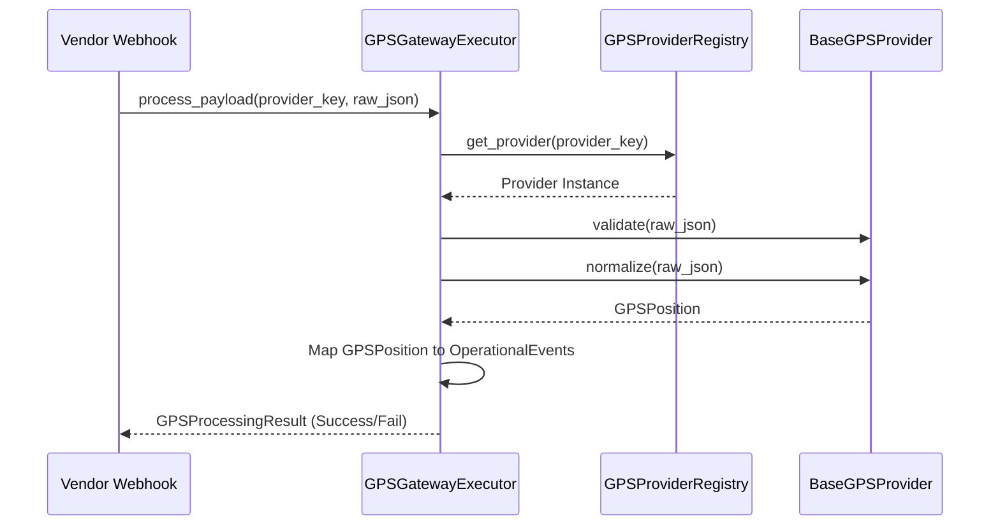

# GPS Gateway Framework

## Architecture Overview
The GPS Gateway Framework resides in the `infrastructure/gps/` boundary layer. It is responsible for ingesting vendor-specific telemetry payloads, normalizing them into a consistent structure, and generating immutable Operational Events for downstream consumption by the Fleet Intelligence Engine.

It provides a hardware-agnostic abstraction for GPS devices and tracking platforms.

### Scope and Boundaries
**The GPS Gateway Framework DOES:**
- Validate incoming vendor payloads for generic structural integrity (e.g. lat/lon bounds).
- Normalize coordinate precision, timestamps, and speeds into standardized units.
- Parse telemetry fields into a strict `GPSPosition` model centered on the provider device identifier (IMEI).
- Expose `ProviderCapabilities` to denote which fields are supported.
- Emit purely observational Operational Events like `PositionRecorded` and `IgnitionStateChanged`.

**The GPS Gateway Framework DOES NOT:**
- Map Device IMEIs to FleetGuard `vehicle_id`s. This is the responsibility of the Device Mapping Service.
- Calculate business logic, driver behaviors (harsh braking), or fuel theft.
- Execute intelligence rule engines.

## Processing Lifecycle

## Immutable Data Models
- **`ProviderCapabilities`**: Declarative flags identifying if a hardware provider supports attributes like `ignition`, `heading`, or `altitude`.
- **`GPSPosition`**: The intermediate normalized representation containing common telemetry data fields. Always uses provider-native identifiers (like IMEI).
- **`GPSProcessingResult`**: Wrapper containing generated events and explicit `GPSProcessingStatus` enums (`SUCCESS`, `VALIDATION_FAILED`, etc.)
- **Operational Events (`events.py`)**: Emits `PositionRecorded` and `IgnitionStateChanged`.

## Normalization Standards
- **Coordinates**: Decimal degrees, bounded to -90/90 and -180/180, rounded to 6 decimals.
- **Speed**: Always converted to `km/h`.
- **Timestamps**: Always converted to UTC `datetime` objects.
- **Heading**: Constrained to 0-360 degrees.
- **Ignition**: Boolean (`True`/`False`).

## Extension Guide
To add a new GPS provider (e.g. `CalAmp`):
1. Create `calamp.py` in `providers/` extending `BaseGPSProvider`.
2. Define the provider's `key()` (e.g. "calamp").
3. Declare `capabilities()` (e.g., if it doesn't support heading, set `supports_heading=False`).
4. Implement `.validate()` using `validate_telemetry_payload`.
5. Implement `.normalize()` converting CalAmp's JSON structure into a `GPSPosition` utilizing the functions in `normalizers.py`.
6. Register the provider in `GPSProviderRegistry`.

## Anti-Patterns
- **Injecting `vehicle_id`**: Do NOT attempt to query the database inside the provider or executor to resolve the FleetGuard `vehicle_id`. The GPS layer operates strictly on device IDs. Downstream systems resolve the vehicle.
- **Overlapping Events**: Emitting `VehicleLocationUpdated` in addition to `PositionRecorded` breaks single-responsibility event boundaries. Keep events strictly factual.
