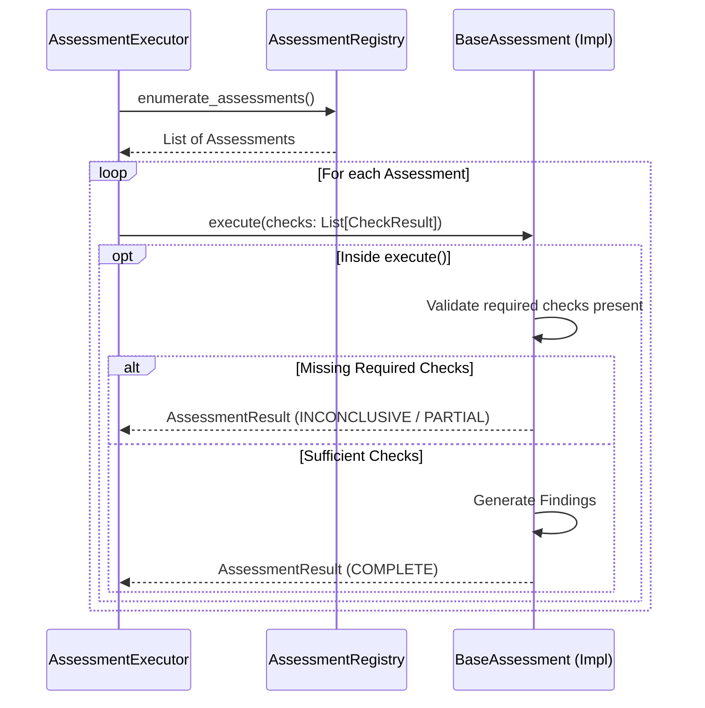

# Assessment Framework

## Overview
The Assessment Framework is the next layer of the Fleet Intelligence Engine. While Checks objectively evaluate facts (producing `CheckResult`s), Assessments group related CheckResults together to form a structured domain interpretation. Assessments are completely agnostic of business risk or policy; their sole job is to interpret factual check outcomes into a clear, domain-specific `AssessmentResult` enriched with structured findings.

## Responsibilities
**What assessments are responsible for:**
- Consuming a collection of `CheckResult` objects.
- Determining if sufficient checks are present to form a conclusion (`COMPLETE`, `PARTIAL`, or `INCONCLUSIVE`).
- Generating strongly typed `Finding` objects that describe the specific discoveries.
- Returning an immutable `AssessmentResult` that preserves the complete list of contributing checks.

**What assessments must never do:**
- Access the `EvidencePackage` (this breaks the architectural abstraction; only Checks consume Evidence).
- Calculate business risk (e.g., returning "High Risk").
- Make global recommendations (e.g., "Reject Event").
- Mutate incoming `CheckResult` objects.
- Access external services or databases.

## Architecture



## Lifecycle
1. **Registration**: Assessment classes inherit from `BaseAssessment` and register their stable keys via `AssessmentRegistry`.
2. **Execution**: The `AssessmentExecutor` retrieves all instantiated assessments.
3. **Execution Safety**: The executor wraps each assessment's `execute()` method in a broad exception handler to prevent a crashing assessment from halting the pipeline.
4. **Internal Decision**: Unlike Checks (where the executor guards against missing required evidence), the *assessment itself* examines the incoming `CheckResult`s to decide if it returns `PARTIAL` or `INCONCLUSIVE`. This is because only the assessment understands if missing checks are fatal to the analysis or just limiting.
5. **Output**: The executor aggregates the resulting `AssessmentResult`s.

## Public Components
- **`BaseAssessment`**: Abstract base class. Defines stable keys, required check dependencies, and the `execute()` logic.
- **`AssessmentResult`**: Immutable model containing the `assessment_key`, `status`, structured `findings`, and a preserved list of all `contributing_checks`.
- **`AssessmentStatus`**: Enum (`COMPLETE`, `PARTIAL`, `INCONCLUSIVE`, `ERROR`).
- **`Finding`**: Strongly typed domain finding model replacing generic lists of strings.
- **`AssessmentRegistry`**: Dynamic discovery layer.
- **`AssessmentExecutor`**: The safe execution engine.

## Required vs Optional Checks
- **Required Checks**: Identifiers (keys) of checks that the assessment ideally needs. The assessment logic explicitly checks for these and yields `PARTIAL` or `INCONCLUSIVE` if they are missing.
- **Optional Checks**: Checks that add flavor or confidence to the findings but are not strictly required.

## Explainability
The framework is designed for deep explainability. 
An `AssessmentResult` does not just store the string names of the checks it used; it retains the **complete `CheckResult` objects** inside its `contributing_checks` property. 
When a Domain Risk Engine eventually consumes this `AssessmentResult` to calculate risk, it will attach the assessment to its profile. This ensures the final `Recommendation` contains a perfect, unbroken tree:
*Recommendation -> RiskProfile -> AssessmentResult -> List[CheckResult] -> List[Evidence]*

## Extension Guide
To create a new assessment:
1. Inherit from `BaseAssessment`.
2. Define `key()` (e.g., `"fuel.station_proximity"`).
3. Define `required_checks()` using the stable keys of the checks you depend on.
4. Override `execute(checks: List[CheckResult]) -> AssessmentResult`.
5. Call `AssessmentRegistry.register()` during bootstrap.

```python
class FuelIntegrityAssessment(BaseAssessment):
    @classmethod
    def key(cls) -> str:
        return "fuel.transaction_integrity"
        
    @classmethod
    def required_checks(cls) -> List[str]:
        return ["fuel.sensor_consistency", "fuel.station_proximity"]

    def execute(self, checks: List[CheckResult]) -> AssessmentResult:
        # Extract relevant checks by key
        # Evaluate PASS/FAIL combos
        # Generate Findings
        # Return AssessmentResult
```

## Best Practices
- **Use Stable Identifiers**: Never rely on `check_name` or `assessment_name` (display names) for business logic. Always use `check_key` and `assessment_key`.
- **Emit Structured Findings**: Use the `Finding` model to emit predictable, typed data that UIs and future APIs can easily consume (e.g., `category="LocationMismatch"`).

## Anti-Patterns
- **Don't access EvidencePackage**: Assessments are intentionally blind to raw evidence. If an assessment needs a fact, a Check must expose that fact in a `CheckResult`.
- **Don't calculate business risk**: Avoid outputting things like `finding_key="high_risk_fraud"`. Output factual interpretations like `finding_key="fuel_quantity_discrepancy"`.

## Testing Strategy
The unit tests in `test_assessment_framework.py` comprehensively cover:
- Immutability and structural validation of the `Finding` model.
- Pydantic validation across all execution statuses.
- Strict executor isolation ensuring unhandled errors yield `ERROR` statuses but do not crash the pipeline.
- Validation that missing required checks appropriately result in `INCONCLUSIVE` output.

## Developer Notes
All intelligence assessments must reside in domain-specific directories under the intelligence umbrella (e.g., `infrastructure/intelligence/fuel_domain/assessments/`) rather than modifying this core framework layer.
