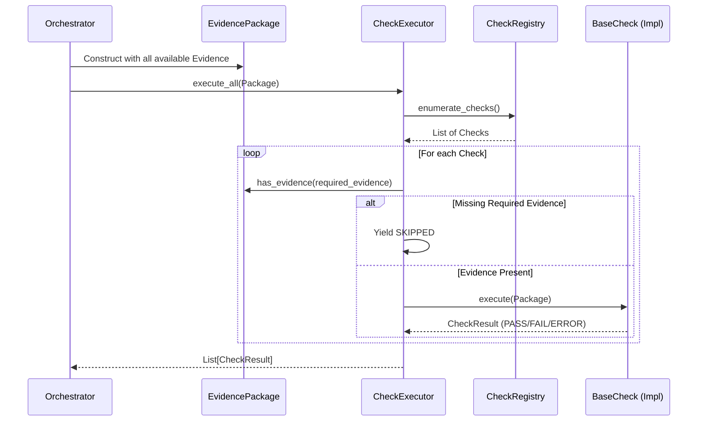

# Check Framework

## Overview
The Check Framework provides the robust, domain-independent foundation for evaluating facts within the Fleet Intelligence Engine. Checks are pure, objective evaluators that consume facts (from the `EvidencePackage`) and produce standardized, factual outcomes (`CheckResult`).

## Responsibilities
**What checks are responsible for:**
- Determining if a specific, objective condition is met by the provided evidence.
- Declaring exactly what evidence is required to execute safely.
- Returning an immutable, factual `CheckResult`.

**What checks must never do:**
- Calculate business risk or generate subjective scores.
- Mutate the `EvidencePackage` or any of its contained evidence objects.
- Perform network requests, database lookups, or interact with external services.
- Make recommendations or policy decisions.

## Architecture



## Lifecycle
1. **Registration**: Check classes inherit from `BaseCheck` and are registered in the `CheckRegistry` at startup.
2. **Discovery**: The `CheckExecutor` enumerates all registered checks deterministically (sorted alphabetically).
3. **Execution Guard**: For each check, the executor verifies the presence of `required_evidence`. If any is missing, it immediately skips the check.
4. **Execution**: The executor instantiates the check statelessly and calls `execute()`.
5. **Fault Isolation**: If a check raises an unhandled exception, the executor captures it, returns an `ERROR` status, and continues with the remaining checks.

## Public Components
- **`BaseCheck`**: Abstract base class. Defines `required_evidence()`, `optional_evidence()`, and `execute()`.
- **`CheckResult`**: Immutable model containing the `check_name`, `status`, explanatory `message`, `evidence_used`, execution timing, and debug `metadata`.
- **`CheckStatus`**: Strongly typed Enum (`PASS`, `FAIL`, `SKIPPED`, `ERROR`).
- **`CheckRegistry`**: Single source of truth for check discovery. Does not execute.
- **`CheckExecutor`**: Manages execution flow, evidence guarding, and fault isolation.

## Required vs Optional Evidence
The execution model heavily emphasizes **Adaptive Intelligence**. 
- **Required Evidence**: Must be present in the `EvidencePackage`. If missing, the framework automatically returns `SKIPPED`. Missing evidence is *not* a failure; it simply means the check was not applicable.
- **Optional Evidence**: Might be used if present (e.g., cross-referencing GPS with a receipt). If missing, the check executes normally but may adapt its internal logic.

## Explainability
The framework is designed for total explainability. Every `CheckResult` captures the `check_name`, a human-readable `message`, and the exact `evidence_used` (by type/name). 
When a downstream `GlobalPolicyEngine` produces a recommendation to reject an event, it will attach these `CheckResult`s to the final payload. A fleet operator can definitively trace a rejection back to: *"FuelQuantityConsistencyCheck FAILED because FuelSensorEvidence did not match ReceiptEvidence."*

## Extension Guide
To create a new check:
1. Inherit from `BaseCheck`.
2. Define `required_evidence()` returning a list of `BaseEvidence` subclasses.
3. Override `execute(package: EvidencePackage) -> CheckResult`.
4. Call `CheckRegistry.register()` during initialization.

```python
class StationProximityCheck(BaseCheck):
    @classmethod
    def required_evidence(cls):
        return [ReceiptEvidence, GPSEvidence]
        
    def execute(self, package):
        gps = package.get_evidence(GPSEvidence)
        # perform logic...
        return CheckResult(...)
```

## Best Practices
- **Embrace Statelessness**: Do not store data on `self` during `execute()`.
- **Return Descriptive Messages**: "GPS coordinates are 150m from station" is better than "Distance exceeded limit."
- **List Used Evidence**: Explicitly list the types of evidence actively evaluated in `evidence_used`.

## Anti-Patterns
- **Don't calculate business risk**: Avoid returning "High Risk". Return factual states like `FAIL`.
- **Don't call databases**: Checks must only consume what the `EvidencePackage` provides.
- **Don't mutate evidence**: Pydantic will block this, but do not attempt it.
- **Don't make recommendations**: A check cannot decide if an event should be "REJECTED".

## Testing Strategy
The Check Framework is covered by comprehensive unit tests (`test_check_framework.py`). It specifically covers:
- Guard behavior (missing required evidence = SKIPPED).
- Fault isolation (one check throwing `ValueError` = ERROR result, execution continues).
- Deterministic ordering and registry conflicts.

## Developer Notes
All intelligence checks must reside in domain-specific directories under the intelligence umbrella (e.g., `infrastructure/intelligence/fuel_domain/checks/`) rather than modifying the core framework layer.
