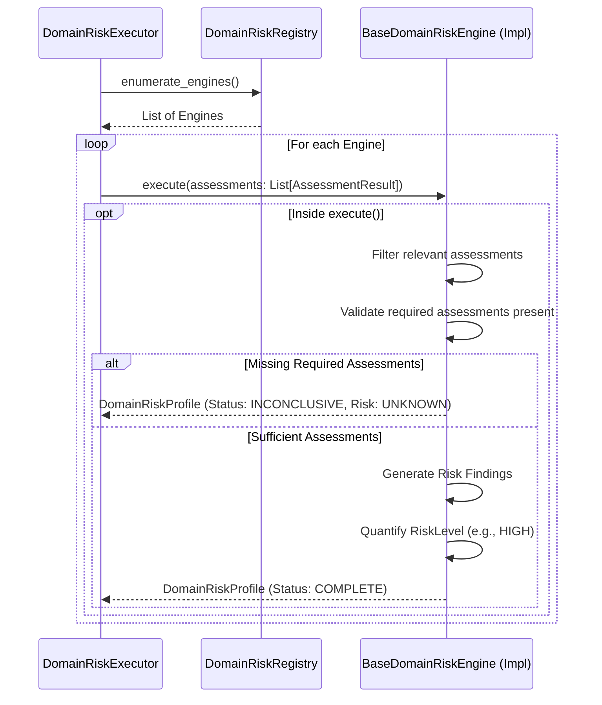

# Domain Risk Framework

## Overview
The Domain Risk Framework represents the third layer of the Fleet Intelligence Engine. 
While *Checks* evaluate raw facts, and *Assessments* interpret what those facts mean, **Domain Risk Engines** quantify *how risky* those interpretations are within a specific business domain. 
For example, the Fuel Risk Engine consumes fuel-related assessments to quantify the probability of fuel theft or wastage.

Crucially, Domain Risk Engines do **not** make final global recommendations (like rejecting a transaction). They strictly quantify domain-specific risk, providing structured intelligence to the Global Decision Engine.

## Responsibilities
**What Domain Risk Engines are responsible for:**
- Consuming a full collection of `AssessmentResult` objects.
- Filtering the assessments to find the ones they care about (using stable keys).
- Determining an execution state (`DomainRiskStatus`: COMPLETE, PARTIAL, INCONCLUSIVE).
- Quantifying the severity of business risk (`RiskLevel`: LOW, MEDIUM, HIGH, CRITICAL, UNKNOWN).
- Returning an immutable `DomainRiskProfile` that preserves the complete list of contributing assessments.

**What Domain Risk Engines must never do:**
- Access `Evidence` or `CheckResults` directly (they must respect the architectural layers and only consume Assessments).
- Filter out assessments *before* execution—the Executor provides the full list, the engine selects what it needs.
- Make global recommendations (e.g., "Reject Event").
- Mutate incoming `AssessmentResult` objects.
- Access external services or databases.

## Architecture

## Lifecycle
1. **Registration**: Risk engines inherit from `BaseDomainRiskEngine` and register their stable keys via `DomainRiskRegistry`.
2. **Execution**: The `DomainRiskExecutor` retrieves all instantiated risk engines.
3. **Execution Safety**: The executor wraps each engine's `execute()` method. If an unhandled Python exception occurs (e.g., a `ValueError`), the executor isolates the fault and safely produces a `DomainRiskProfile` with `status=ERROR` and `risk_level=UNKNOWN`.
4. **Internal Filtering & Decision**: Unlike the Check Executor (which guards execution based on missing required evidence), the Domain Risk Executor simply passes *all* available assessments to the engine. The engine itself filters for its `required_assessments()` and decides whether its execution status should be `PARTIAL` or `INCONCLUSIVE`.
5. **Output**: The executor aggregates the resulting `DomainRiskProfile`s.

## Public Components
- **`BaseDomainRiskEngine`**: Abstract base class defining stable keys, required assessment dependencies, and the `execute()` logic.
- **`DomainRiskProfile`**: Immutable model containing the execution `status`, quantified `risk_level`, structured `findings`, and a preserved list of all `supporting_assessments`.
- **`DomainRiskStatus`**: Enum representing the execution state (`COMPLETE`, `PARTIAL`, `INCONCLUSIVE`, `ERROR`).
- **`RiskLevel`**: Enum representing the business risk severity (`UNKNOWN`, `LOW`, `MEDIUM`, `HIGH`, `CRITICAL`).
- **`RiskFinding`**: Strongly typed finding model containing `finding_key`, `category`, and explanatory text.
- **`DomainRiskRegistry`**: Dynamic discovery layer.
- **`DomainRiskExecutor`**: The safe execution engine.

## Execution Status vs. Business Risk
A key design principle of this framework is the strict separation between execution semantics and business semantics.
- **`DomainRiskStatus` (Execution)**: Describes *how* the engine executed. Did it have all the data it needed? (`COMPLETE`). Was it missing some optional data? (`PARTIAL`). Did it crash? (`ERROR`).
- **`RiskLevel` (Business)**: Describes the actual severity of the risk found. (`LOW`, `HIGH`).

By separating these, the system can express complex realities:
- `Status=COMPLETE`, `Risk=LOW` (Everything worked perfectly, and there is no risk).
- `Status=PARTIAL`, `Risk=HIGH` (We didn't have all data, but what we *did* have is extremely alarming).
- `Status=ERROR`, `Risk=UNKNOWN` (The engine crashed, we cannot quantify the risk).

## Explainability
The framework provides perfect explainability. 
A `DomainRiskProfile` does not just store the string names of the assessments it used; it retains the **complete `AssessmentResult` objects** inside its `supporting_assessments` property. Since each `AssessmentResult` already retains its `CheckResult`s, the Domain Risk Engine provides a complete, unbroken audit trail from the calculated risk down to the raw evidence.

## Extension Guide
To create a new domain risk engine:
1. Inherit from `BaseDomainRiskEngine`.
2. Define `key()` (e.g., `"fuel.transaction_risk"`).
3. Define `required_assessments()` using the stable keys of the assessments you depend on.
4. Override `execute(assessments: List[AssessmentResult]) -> DomainRiskProfile`.
5. Call `DomainRiskRegistry.register()` during bootstrap.

## Testing Strategy
The unit tests in `test_domain_risk_framework.py` comprehensively cover:
- Isolation of execution faults resulting in safe dual-state profiles (`ERROR` / `UNKNOWN`).
- Verification that engines correctly filter and ignore unrelated assessments.
- Deterministic orchestration via the registry and executor.
