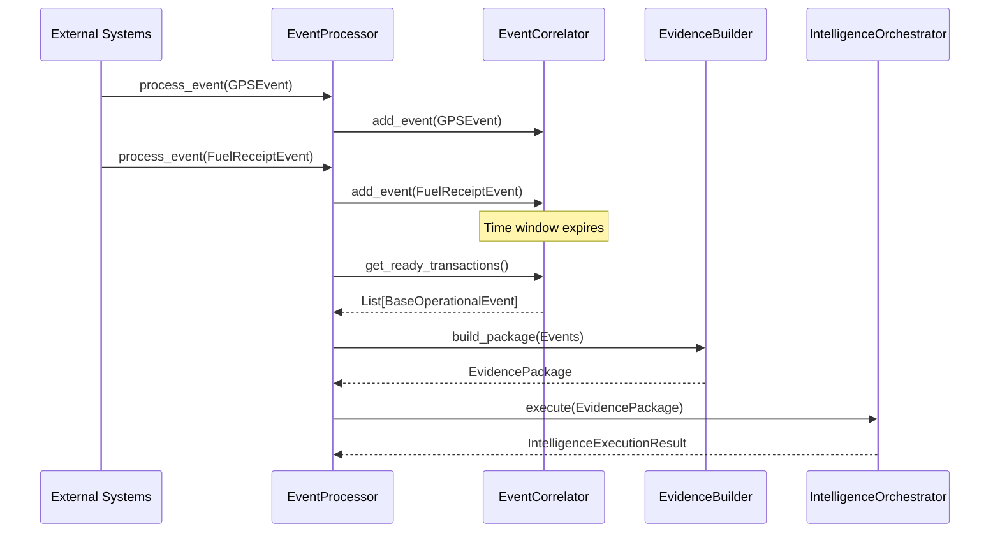

# Operational Event Processing

The **Event Processing Layer** acts as the strict boundary between external, asynchronous operational systems and the synchronous Fleet Intelligence Engine.

## Purpose

Operational systems (like Telematics, Mobile Apps, and APIs) generate events independently and asynchronously. The Event Processing layer is responsible for capturing these raw inputs, correlating them into complete "transactions", mapping them into immutable `EvidencePackage` objects, and feeding them to the Intelligence Orchestrator. 

This layer executes **zero business logic, validation, or risk calculation**. It exists solely to bridge the asynchronous real world with the synchronous intelligence engine.

## Architecture & Lifecycle

1. **Raw Event Ingestion**: `EventProcessor.process_event(event)` is called with an immutable `BaseOperationalEvent` (e.g. `GPSEvent`, `FuelReceiptEvent`).
2. **Correlation**: The event is buffered in the `EventCorrelator`.
3. **Window Closure**: When the correlator determines a transaction is complete (e.g. a time window expires), it yields the correlated group of events.
4. **Evidence Construction**: The `EvidenceBuilder` maps the raw events into structured `BaseEvidence` models (e.g. `GPSEvidence`, `ReceiptEvidence`), strictly preserving the `event_id` as the `evidence_id` for perfect traceability.
5. **Execution**: The constructed `EvidencePackage` is passed to the `IntelligenceOrchestrator`, which executes the full intelligence pipeline and returns the final `IntelligenceExecutionResult`.

### Sequence Diagram

## Correlation Strategy

For this foundational milestone, the `EventCorrelator` uses an in-memory buffer, grouping events by an explicit `correlation_id` over a fixed time window. 

**Future Extensibility**: The `EventCorrelator` interface is intentionally designed so future iterations can easily support advanced distributed strategies without modifying downstream layers:
- Redis/Kafka-backed distributed windows.
- Correlation via **Vehicle Identity** or **Spatial Proximity** (e.g. grouping all events for Truck A within 500m of a location).
- State-machine correlation (waiting for specific event types before closing the window).

## EvidenceBuilder Responsibility

The `EvidenceBuilder` is strictly an object transformer.
- **It MUST** map raw event data into strongly-typed `Evidence` models.
- **It MUST** preserve data provenance (mapping `event_id` directly to `evidence_id`).
- **It MUST NEVER** perform data validation, duplicate detection, or intelligence decisions. Those responsibilities belong exclusively to the Validation and Intelligence frameworks.

## Future Considerations

- **Replay Protection & Duplicate Detection**: While this initial implementation buffers duplicate events, future versions will leverage the `event_id` to provide robust, at-least-once replay protection and duplicate rejection before events enter the correlation window.
- **Persistence**: Moving from an in-memory correlator to a persistent datastore (like Redis) to support multi-node scaling and fault tolerance across container restarts.
