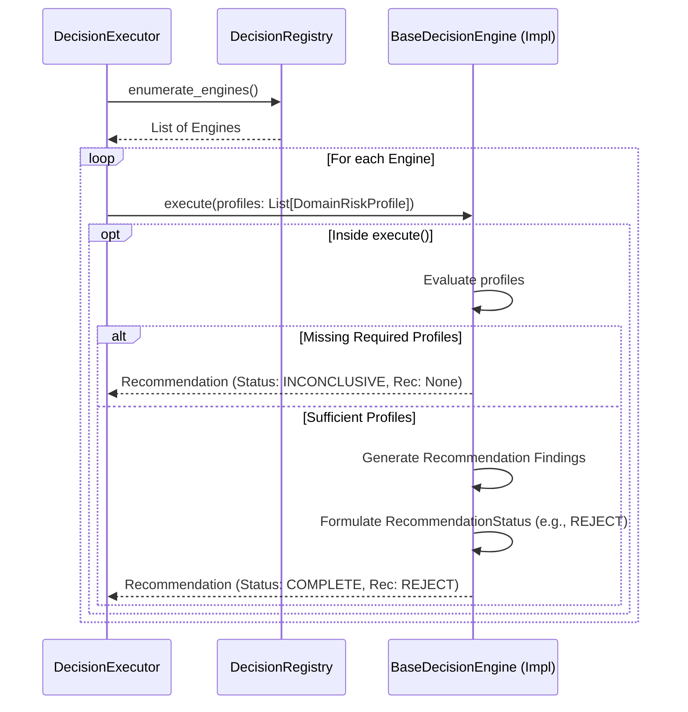

# Global Decision Framework

## Overview
The Global Decision Framework is the final orchestration tier of the Fleet Intelligence Engine. 
It consumes quantified `DomainRiskProfile`s from independent business domains (e.g., Fuel Risk, Driver Behaviour Risk, Maintenance Risk) and uses them to reach a final, explainable business recommendation (e.g., "Approve", "Review Required", "Reject").

Crucially, the Global Decision Framework is entirely domain-agnostic. It does **not** recalculate risk, evaluate raw evidence, or re-run assessments. It exists strictly to aggregate independent risk profiles and apply a final decision policy.

## Responsibilities
**What Decision Engines are responsible for:**
- Consuming a collection of `DomainRiskProfile` objects.
- Applying a global business policy to evaluate the aggregate risk across domains.
- Determining an execution state (`DecisionStatus`: COMPLETE, PARTIAL, INCONCLUSIVE, ERROR).
- Yielding a final business recommendation (`RecommendationStatus`: APPROVE, APPROVE_WITH_REVIEW, REVIEW_REQUIRED, REJECT).
- Returning an immutable `Recommendation` that preserves the complete list of contributing domain risk profiles.

**What Decision Engines must never do:**
- Access `Evidence`, `CheckResult`, or `AssessmentResult` objects directly (they must respect the architectural layers and only consume Domain Risk Profiles).
- Calculate domain-specific risk logic.
- Make assumptions about specific customers (customer policy is handled via dynamic configuration, not hardcoded into the base framework).
- Mutate incoming `DomainRiskProfile` objects.
- Access external services or databases.

## Architecture

## Lifecycle
1. **Registration**: Decision engines inherit from `BaseDecisionEngine` and register their stable keys via `DecisionRegistry`.
2. **Execution**: The `DecisionExecutor` retrieves all instantiated decision engines.
3. **Execution Safety**: The executor wraps each engine's `execute()` method. If an unhandled exception occurs, the executor safely produces a `Recommendation` with `status=ERROR` and `recommendation=None`. *Note: The framework itself never infers a fallback recommendation like REVIEW_REQUIRED; an uncalculated state is simply `None`.*
4. **Internal Decision**: The decision engine consumes the `DomainRiskProfile` collection, determines if it has enough context to form a decision (yielding `COMPLETE` or `INCONCLUSIVE`), and outputs the final `RecommendationStatus`.
5. **Output**: The executor aggregates the resulting `Recommendation` objects.

## Public Components
- **`BaseDecisionEngine`**: Abstract base class defining stable keys and the `execute()` logic.
- **`Recommendation`**: Immutable model containing the execution `status`, the final `recommendation`, structured `findings`, and a preserved list of all `supporting_profiles`.
- **`DecisionStatus`**: Enum representing the execution state (`COMPLETE`, `PARTIAL`, `INCONCLUSIVE`, `ERROR`).
- **`RecommendationStatus`**: Enum representing the final business decision (`APPROVE`, `APPROVE_WITH_REVIEW`, `REVIEW_REQUIRED`, `REJECT`).
- **`RecommendationFinding`**: Strongly typed finding model summarizing the logic applied.
- **`DecisionRegistry`**: Dynamic discovery layer.
- **`DecisionExecutor`**: The safe execution engine.

## Execution Status vs. Business Recommendation
The framework maintains a strict separation between execution semantics and business semantics.
- **`DecisionStatus` (Execution)**: Describes *how* the engine executed. (`COMPLETE`, `ERROR`).
- **`RecommendationStatus` (Business)**: Describes the actual business outcome. (`APPROVE`, `REJECT`).

If `DecisionStatus` is `ERROR` or `INCONCLUSIVE`, the `RecommendationStatus` will be `None`. The framework refuses to guess or fallback to a default business policy when execution fails.

## Complete Explainability
Because the architectural layers nest structurally, the `Recommendation` provides a perfect, mathematically sound trace back to the physical world:
1. `Recommendation` contains `DomainRiskProfile`s.
2. `DomainRiskProfile` contains `AssessmentResult`s.
3. `AssessmentResult` contains `CheckResult`s.
4. `CheckResult` references specific `Evidence`.

When the UI renders "Transaction Rejected," it can walk this exact tree down to "Fuel Receipt didn't match GPS Location."

## Testing Strategy
The unit tests in `test_global_decision_framework.py` comprehensively cover:
- Fault isolation inside the executor (yielding `ERROR` with `None` recommendation).
- Explicit segregation between execution state and the final business recommendation.
- Structural validation of the `Recommendation` preservation tree.
