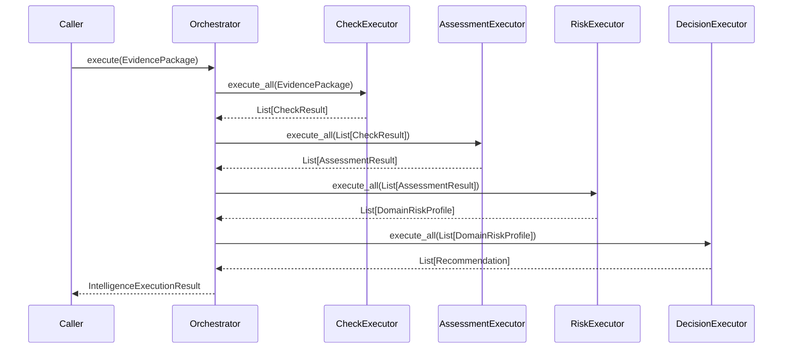

# Intelligence Orchestrator

The Intelligence Orchestrator provides the single, robust entry point for executing the entire 5-Tier Fleet Intelligence Engine pipeline.

## Purpose

The orchestrator guarantees that the framework components execute in the precise, sequential order mandated by the architecture (Checks -> Assessments -> Domain Risk -> Global Decision). By completely isolating execution sequencing from business logic, the Orchestrator ensures the pipeline can be invoked universally for any domain.

## Lifecycle and Architecture

The orchestrator holds references to the four framework executors (`CheckExecutor`, `AssessmentExecutor`, `DomainRiskExecutor`, `DecisionExecutor`).

When an operational event occurs, the caller constructs an `EvidencePackage` (an immutable collection of raw facts) and passes it to the orchestrator:

```python
result = orchestrator.execute(package)
```

The orchestrator synchronously routes the outputs of each tier directly into the inputs of the next tier.

### Sequence Diagram



## Explainability and Traceability

The pipeline's most powerful feature is explainability. The orchestrator returns an `IntelligenceExecutionResult` containing:

1. **`recommendations`**: The final business decisions.
2. **`trace`**: An `ExecutionTrace` object preserving the exact intermediate state of every layer (checks, assessments, profiles). 

This `trace` struct allows downstream analytics, debugging tools, and UIs to display the complete evidence tree without modifying the orchestrator.

## Observability

The orchestrator explicitly avoids embedding general observability concerns (e.g., Datadog tracing, OpenTelemetry, Prometheus metrics). While it records simple local execution time, full distributed tracing and metrics should be implemented via decorators, middleware, or infrastructure layers wrapping the `execute` call.

## Batch Execution

The orchestrator executes a single `EvidencePackage` synchronously. It is deliberately designed so that bulk execution—such as running 10,000 historic fuel transactions through the pipeline—can be implemented using a higher-level batching orchestrator (e.g., using Celery, Kafka streams, or asyncio) *over* this core framework, without altering the framework itself.

## Anti-Patterns
- **Adding business logic**: Never filter evidence, calculate risk, or manipulate data inside the orchestrator.
- **Breaking the sequence**: Never allow the orchestrator to bypass a tier (e.g., feeding checks directly to the Decision Engine).
- **Swallowing errors**: Do not swallow execution errors silently. The orchestrator isolates catastrophic crashes (yielding `IntelligenceExecutionStatus.ERROR`), leaving graceful degradation (e.g., `INCONCLUSIVE` assessments) to the executors themselves.
