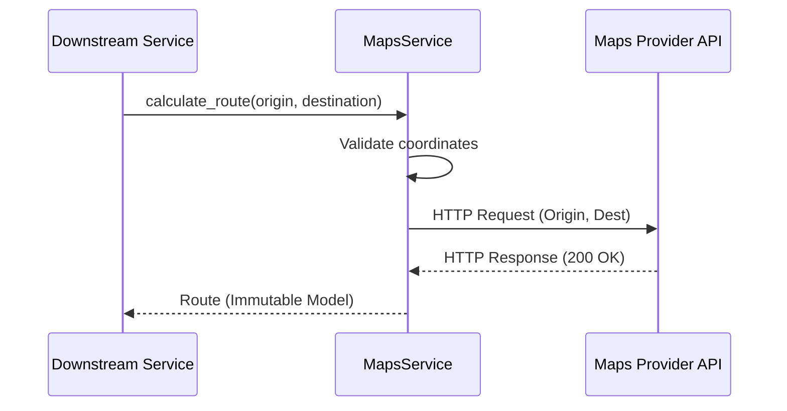

# Maps Service

## Architecture Overview
The Maps Service operates within the infrastructure layer (`infrastructure/maps/`). Its purpose is to provide standard, reliable geospatial operations across the entire FleetGuard platform using a single maps provider configuration (defaulting to Google Maps). 

It is intentionally designed as a lightweight wrapper, completely avoiding over-engineered provider registries or abstract factory patterns. 

### Scope and Boundaries
**The Maps Service DOES:**
- Forward geocode addresses into coordinates.
- Reverse geocode coordinates into readable addresses.
- Calculate distance, route durations, and polyline paths.
- Evaluate straight-line distance and geofence containment using Haversine mathematics (zero API overhead).
- Ensure strict structural validation of input coordinates (e.g. valid lat/lon ranges).

**The Maps Service DOES NOT:**
- Parse incoming telemetry payloads from hardware devices.
- Evaluate business logic like overspeeding, route deviation, or theft risk.
- Trigger Operational Events.

## Core Methods
All methods take and return immutable Pydantic models.

- `reverse_geocode(coordinate: Coordinate) -> Address`
- `forward_geocode(address_string: str) -> Coordinate`
- `calculate_route(origin: Coordinate, destination: Coordinate) -> Route`
- `calculate_eta(origin: Coordinate, destination: Coordinate) -> int` (Returns seconds)
- `calculate_distance(point1: Coordinate, point2: Coordinate) -> float` (Haversine straight-line distance in meters)
- `snap_to_road(path: List[Coordinate]) -> List[Coordinate]`
- `is_inside_geofence(coordinate: Coordinate, geofence: Geofence) -> bool`

## Processing Lifecycle

## Immutable Data Models
- **`Coordinate`**: `latitude`, `longitude`
- **`Address`**: `formatted_address`, `locality`, etc.
- **`Route`**: Extracted distance, duration, and polyline representation.
- **`Geofence`**: Circular boundary defined by a `center` Coordinate and a `radius_meters`.

## Anti-Patterns
- **Premature Abstraction**: Do not attempt to introduce a `BaseMapProvider` class or a `MapProviderRegistry`. If we migrate from Google Maps to Mapbox, we will refactor `maps_service.py` directly. This service is a functional wrapper, not a plugin architecture.
- **Business Logic Leakage**: Do not add a method like `calculate_fuel_burn_for_route()`. The Maps service only provides geospatial data; business deductions belong in the intelligence domain.
