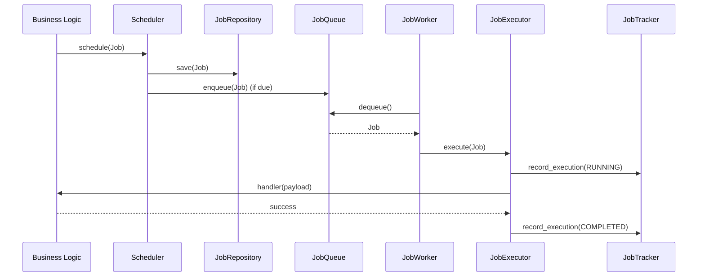

# Scheduler & Job Framework

## Architecture Overview
The Scheduler Framework operates within the infrastructure layer (`infrastructure/scheduler/`). Its purpose is to provide a central execution engine for delayed, scheduled, and recurring jobs.

It strictly implements the **Separation of Concerns**: The Scheduler decides *when* a job runs. The Queue handles *delivery*. The Executor triggers the *handler*. The Business Logic determines *what* to do. The Scheduler never imports or depends on Business Logic.

### Scope and Boundaries
**The Scheduler DOES:**
- Persist job definitions.
- Enqueue jobs that are due for execution.
- Allow workers to dequeue and execute jobs.
- Retry failed jobs based on a configurable `RetryPolicy`.
- Maintain an append-only track of execution lifecycles (`JobExecution`).

**The Scheduler DOES NOT:**
- Execute Fleet Intelligence or validation rules.
- Determine if a business event warrants scheduling a job (business domains must request it).

## Core Components
- **`JobRegistry`**: Maps string identifiers (`job_type`) to python Callables. Business modules register their handlers here on application boot.
- **`Scheduler`**: The frontend for scheduling new jobs. Accepts a `Job`, validates it, persists it, and queues it if immediately due.
- **`BaseJobQueue`**: An abstract interface for message queuing (currently `InMemoryJobQueue`).
- **`JobWorker`**: Consumes from the queue and triggers the executor.
- **`JobExecutor`**: Resolves the handler from the registry, executes the payload, catches exceptions, and logs state transitions (RUNNING, COMPLETED, FAILED) to the `JobTracker`.
- **`JobTracker`**: An append-only log of executions using `BaseExecutionRepository`. 

## Lifecycle Diagram

## Immutable Data Models
- **`Job`**: Immutable definition containing `schedule_type`, `priority`, `retry_policy`, and `payload`.
- **`JobExecution`**: Immutable state snapshot representing an execution attempt (contains `started_at`, `status`, `error`, etc). Repeated states or multiple runs yield multiple `JobExecution` models in the repository.
- **`RetryPolicy`**: Configuration attached to a job (e.g. exponential backoff).
- **`RecurrencePolicy`**: Attached to `RECURRING` jobs to calculate the next tick.

## Anti-Patterns
- **Coupling Business Logic**: Do not place `calculate_route_deviation()` directly inside `scheduler.py`.
- **Mutating Job State**: Do not update `job.status = "COMPLETED"`. Jobs are immutable definitions. Create and persist a new `JobExecution` with status `COMPLETED`.
