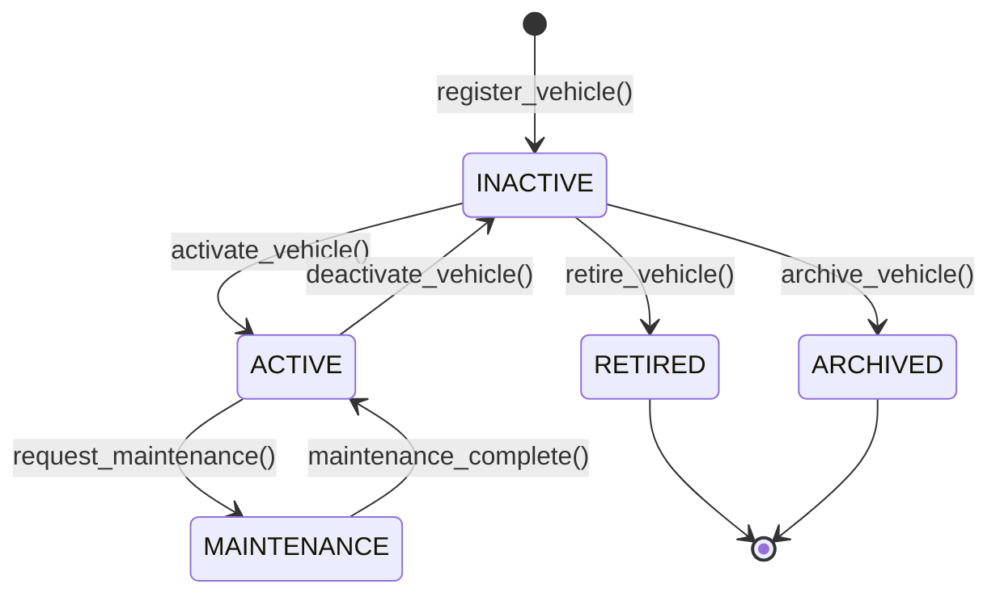

# Vehicle Management Domain

## Architecture Overview
The Vehicle Management Domain (`domain/vehicle/`) serves as the absolute single source of truth for all vehicle identities and lifecycles across FleetGuard. All other domains (Fuel, Trips, Compliance, Intelligence, etc.) must reference canonical vehicles using their UUID rather than duplicating structural information.

This domain implements a strict **Domain-Driven Design (DDD)** pattern. It prevents any external components from pushing a vehicle into an invalid state.

### Scope and Boundaries
**The Vehicle Domain DOES:**
- Act as the canonical owner of vehicle identifiers (UUID, Registration, VIN).
- Strictly enforce vehicle lifecycle transitions (`INACTIVE` -> `ACTIVE` -> `MAINTENANCE` -> `RETIRED`).
- Maintain core structural metadata (`VehicleSpecification`) and operational settings (`VehicleConfiguration`).
- Generate Immutable Domain Events (`VehicleRegistered`, `VehicleActivated`) for other services to consume.

**The Vehicle Domain DOES NOT:**
- Execute or validate business rules unrelated to the vehicle core identity.
- Listen to or ingest GPS telemetry or Fuel data.
- Maintain complex relationships with drivers or geofences.

## Core Components
- **`VehicleAggregate`**: The root aggregate responsible for processing commands. Direct mutation of the `Vehicle` model outside of this aggregate is strictly prohibited. It applies business rules (e.g. checking if a retired vehicle can be reactivated) and generates a tuple of `(Vehicle, [DomainEvent])`.
- **`VehicleService`**: Orchestrates operations between the HTTP/API requests, the Aggregate, and the Repository. It handles cross-aggregate duplication checks (like unique Registration Numbers).
- **`Value Objects`**: Registration Numbers, VINs, and Engine Numbers are wrapped in Value Objects (`RegistrationNumber`, `VIN`). They self-validate upon instantiation, meaning an invalid Registration Number can literally never exist in memory.
- **`VehicleQueries`**: Separates Read concerns from Write concerns (CQRS light). Complex list filters or UI projections are built here instead of cluttering the Aggregate.

## Lifecycle Diagram

## Anti-Patterns
- **Bypassing the Aggregate**: Never update a `Vehicle` model directly via `model_copy(update={...})` from outside `aggregate.py`. Always call `VehicleAggregate.some_action()`.
- **Duplicating Vehicle State**: Do not store the `registration_number` or `fuel_type` in the `Trips` domain database. Store the `vehicle_id` and query this domain.
